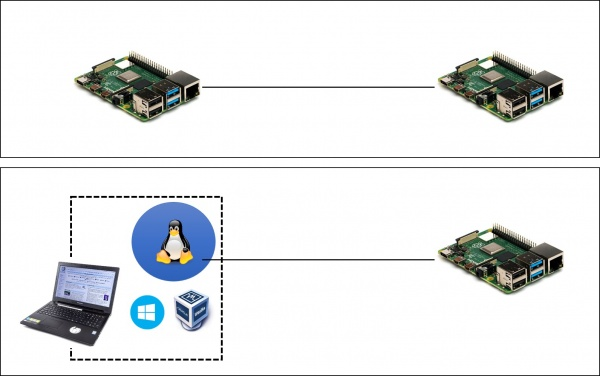

# Virtual Box と VM の準備

## 概要

従来，情報科学実験 I ではグループを構成して実験を進める計画になっています．従って，グループ内の複数の RaspberryPi 間で通信を行うプログラムを構築し，その通信内容や通信性能を計測し，分析します．しかしながら，個人で実験を進めなければならない場合も時にはあるかと思いますので，その際は各自のノート PC 上に Linux 環境を構築して通信アプリケーションの片側を実行するようにします．

RaspberryPi 同士の通信環境とは異なる環境になりますので，異なる環境間で計測結果の比較を行うことは妥当ではありません． この点には注意が必要ですが，通信アプリケーションの開発と動作確認には使えるでしょう．

## VirtualBox と Linux VM の導入

VirtualBox を導入してください．拡張パック（Extension Pack）も合わせて導入してください．

[Oracle VM VirtualBox](https://www.virtualbox.org/wiki/Downloads)

静岡大学情報学部で学年度ごとに用意している Linux VM とインストールガイドは以下にあります． 以下の oooo 部分は入学年度で置き換えてください．

http://whitebear.cs.inf.shizuoka.ac.jp/linux/oooo/
