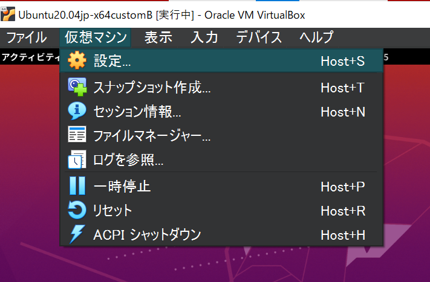
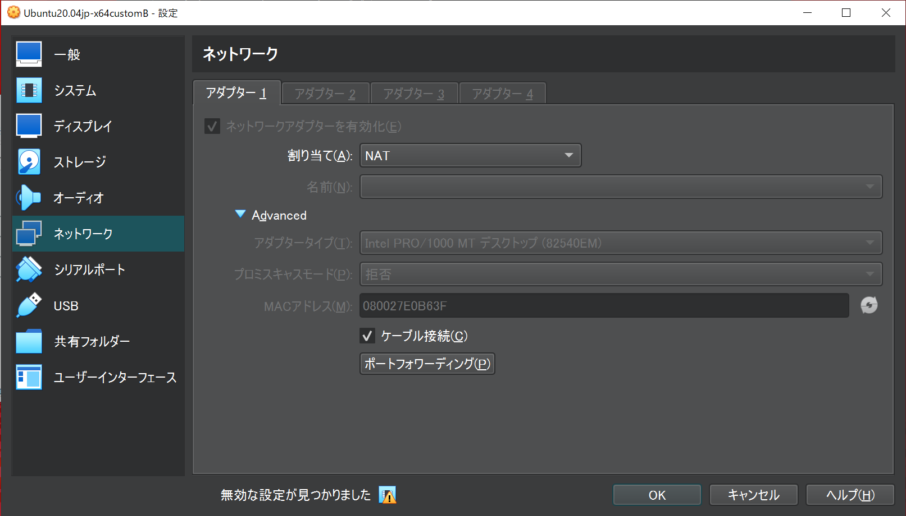
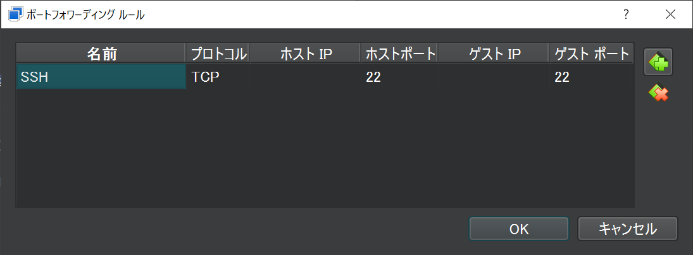
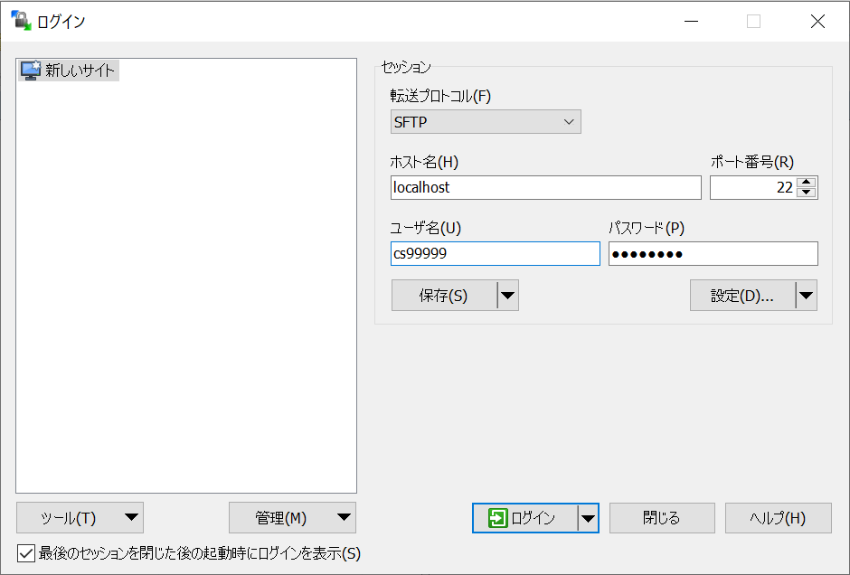

# RaspberryPiの接続

２つの機材を用いて作業を行なう都合上，ファイルのやり取りなどで通信を行う必要が発生します．本項では主にRaspberryPiとPCの通信を行う方法をいくつか紹介します．

## IPアドレスの確認方法

RaspberryPiのIPアドレスは以下のコマンドを用いて確認します．本講義ではwlan0のIPを高頻度で扱うため確認方法を覚えておくと良いでしょう．

```shell
$ ip a

1: lo: ...
...
2: eth0: ...
...
3: wlan0: ...
inet 192.168.100.17/24
...
```

上記出力では結果を省略していますが，wlan0においてIPが`192.168.100.17`であることが解ると思います．

また，WindowsのIPアドレスはコマンドプロンプトにおいて以下のコマンドを用いて確認します．

```shell
$ ipconfig
```

## SSHクライアントのインストール

RaspberryPiへのファイル転送にはSSHプロトコルを利用します．SSHプロトコルはターミナル接続用途にもファイル転送用途にも利用できます（通信アプリケーションは異なります）．

### Windowsを使う場合

Webアプリケーション開発に必要なソフトは3つです

- SSH(ターミナル接続)
  - 大抵の場合標準で使用できます．コマンドラインからsshと打ってみてください．
  - お勧め:[Putty](https://www.putty.org/)
  - （お勧め:[TeraTerm](https://osdn.net/projects/ttssh2/releases/)）
- SCP(ファイル転送)
  - お勧め：[WinSCP](http://winscp.net/eng/docs/lang:jp)

### Linuxを使う場合

- SSH(ターミナル接続)
  - 大抵の場合標準で使用できます．コマンドラインからsshと打ってみてください．
  - [【 ssh 】 SSHでリモート・マシンのコマンドを実行する](http://itpro.nikkeibp.co.jp/article/COLUMN/20060227/230889/)
-SCP(ファイル転送)
  - 大抵の場合標準で使用できます．コマンドラインからscpと打ってみてください．
  - [【 scp 】 リモート・マシン間でファイルをコピーする](http://itpro.nikkeibp.co.jp/article/COLUMN/20060227/230878/)

## RaspberryPiへのターミナル接続

Windows環境からの接続を例に説明します．

TeraTermを起動，RaspberryPiのIPアドレスを入力して先程確認したIPアドレスを打ち込み（画像では`192.168.1.101`）SSHで接続


RaspberryPi上のアカウント（pi）でログイン


初回のみセキュリティ警告が出てくるので\[続行\]を押します．ログインに成功すればコマンドプロンプトが出てきます．

## RaspberryPiへのファイル転送

WinSCPを起動します．ログイン画面が開くので新規のホストを設定しログインします．

- 転送プロトコル:SFTP
- ホスト名:`ip a`で確認したIPアドレス
- ユーザ名:pi
- パスワード:設定したパスワード


最初にアクセスした時のみセキュリティ警告が出ますのでOKします．エクスプローラのようにドラッグ＆ドラップや右クリックメニューでファイルの転送や操作が可能です．

## VMからRaspberryPiへの接続の確認

VMからRaspberryPiへ接続する方法はいくつかの手段がありますが，ここではリンクローカルアドレスを用いた有線による簡易的な接続方法について説明します（他の方法を試したい方は各自で調べてみてください）．

### openssh-serverのインストール

ネットワーク設定を変更する前にVMを起動してください．
後に行う作業にてssh server が起動していることが前提となりますので，インストールされていない場合は以下のコマンドでインストールします．

```shell
$ sudo apt-get update
$ sudo apt-get install openssh-server
```

### VM環境からRaspberryPiへのSSH接続の確認

VM上のLinuxのターミナルを開いて，RaspberryPiにPingを送って通信状態を確認します．大かっこの中は適宜読み替えてください．

```shell
$ ping {確認したRaspberryPiのIPアドレス}
```

SSHでRaspberryPiにログインします．最初の接続のみ，ホスト鍵を受け入れるか聞かれますので"yes"とします．

```shell
$ ssh {確認したRaspberryPiのIPアドレス}
```

ユーザ名とパスワードが一致すれば，ログインできます．SSH接続中は`exit`を打ち込むことで，SSH接続を切ることができます．

```shell
$ exit
```

## VM上のLinuxにPCからファイルを転送

ホストOS（Windows）からゲストOS（Linux）にファイルを転送します．

VirtualBoxのメニューから「仮想マシン」→「設定」を開きます．



ネットワークの設定から「高度」タブを開き「ポートフォワーディング」を開きます．



右上のアイコンをクリックして，フォワーディングルールを追加します．ここでは，ホストOS（Windows）のポート22への接続をゲストOS（Linux）のポート22に転送する設定を行います．



WinSCPを起動し，接続先のホストとして以下の指定して接続します．

- ホスト名:localhost
- ユーザ名:ゲストOSに設定したユーザ名
- パスワード:ゲストOSに設定したパスワード



## モニタがない状況でのRaspberryPiの接続

また，実験室以外で実験を行う場合に，モニタとマウス・キーボードがない状態でRaspberryPiへ接続したい場合があります．別で設定を行うことで対応できますので実施してください．

[モニタがない状況でのRaspberryPiの接続（任意）](./connect_raspberry_non_monitor)

### 外部から接続する場合（任意）

```{important}
VirtualBox の設定上は外部から SSH 接続できる設定ですが，実際には Windows ファイアウォールが接続を遮断して接続できない場合がありますので注意してください．
```

例えば，RaspberryPiからWindowsのイーサネットアダプタに設定したIPアドレスへSSH接続を試みると，ポートフォワーディング設定並びに，ユーザ名・パスワードが正しければログインできるはずですが，ログインできない場合があります，

```shell
$ ssh <VMのユーザー名>@<VMのIP>
```

この場合，Windowsファイアウォールの設定を行えば接続が可能になりますが，セキュリティ上のリスクを伴いますので無理に行う必要はありません．実験では，RaspberryPi側をサーバプログラム，PC上のゲストOS側をクライアントプログラムとして実験を進めてください．

## エディタを使った接続（任意）

VSCodeを用いて開発環境の構築を行います.
興味のある方は実施してみてください.

なお,上記のSSH接続やWinSCPの設定などが済んでいることを前提として話を進めていきます.
必ず上記のSSH接続やWinSCPの設定を済ましてから取り組んでください.

[VSCodeを使った環境構築](./environment_building_vscode)
