# RaspberryPi の接続（固定 IP）

## 概要

ディスプレイとマウス・キーボードがない状態でRaspberryPiへ接続する方法を説明します。
最終的な構成は以下のようになります。


実験中は基本この形式で接続してもらいます。

## 前準備

RaspberryPiへの接続はmDNSを用いてドメイン名で行います。ここでは説明しないため,詳しく知りたい人はavahi daemonやmDNSで調べてみてください。
RaspberryPiの初期設定は以下のようになっています．
- ユーザ名: pi
- パスワード: raspberry
以降の接続ではこのユーザー名とパスワードを用いていきます。

### RaspberryPi と PC の有線ケーブルでの P2P 接続

RaspberryPi の microUSB 端子に電源を接続します．

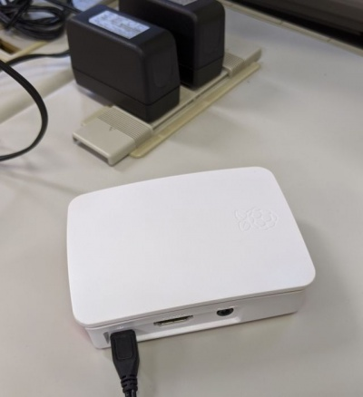

RaspberryPi と PC を LAN ケーブルで直結します（以下の例では USB 接続の LAN アダプタを使っていますが，PC に備え付けの有線 LAN ポートがあればそれに接続します）．

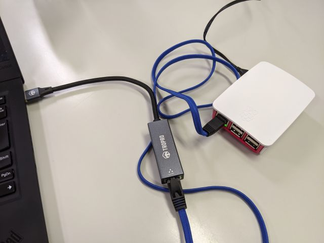

### RaspberryPiとの接続確認
コマンドプロンプトから RaspberryPi の IP アドレスに ping を実行し，接続を確認してください．
```
$ ping raspberrypi.local
```

## PC と Raspberry Pi の接続

### PC と RaspberryPi への VNC による接続

#### VNC Client による接続

VNC を起動し，RaspberryPi の ドメイン名 ( raspberrypi.local ) に接続します．

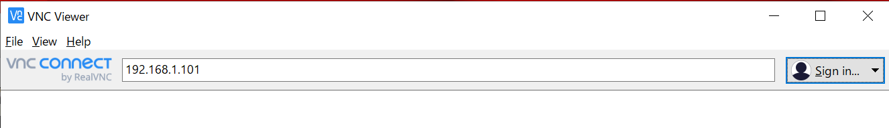

初回のみセキュリティ警告が出ますので Continue します．

ユーザ名とパスワードを入力します．

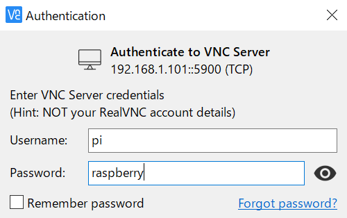

デスクトップ画面にログインできます．


#### パスワードの変更

初期パスワードのままではセキュリティ上問題がありますので，パスワード変更を行います．

ターミナルを開いて，以下のコマンドでパスワード変更をしてください．

パスワード変更はコンソールログイン，VNC 接続や SSH 接続，sudo でのコマンド実行など全てに影響します．

ここで設定したパスワードを忘れると復旧は難しいので特に注意してください．

```shell
 $ passwd
```

#### 無線 LAN の無効化

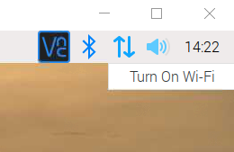

初期設定時
RaspberryPi のセキュリティアップデートを実施するなど（最初に配布したイメージは配布時点のセキュリティアップデート済です），特にネットワーク接続が必要な場合以外は無線 LAN を無効にしておきます．

今回の実験では PC と接続している有線 LAN ネットワークを利用しますので，まだ十分な知識とスキルを身に着けていない方は，混乱がないよう無線 LAN ネットワークを無効にしておいてください．

画像のように表示される場合は既に Wifi は OFF に設定されています．

### SSH クライアントのインストール

RaspberryPi へのファイル転送には SSH プロトコルを利用します．SSH プロトコルはターミナル接続用途にもファイル転送用途にも利用できます（通信アプリケーションは異なります）．

#### Windows を使う場合

Web アプリケーション開発に必要なソフトは 3 つです

- SSH (ターミナル接続)
  - お勧め:Putty [https://www.putty.org/](https://www.putty.org/)
  - （お勧め:TeraTerm [https://osdn.net/projects/ttssh2/releases/](https://osdn.net/projects/ttssh2/releases/) ）
- SCP (ファイル転送)
  - お勧め：WinSCP [http://winscp.net/eng/docs/lang:jp](http://winscp.net/eng/docs/lang:jp)

#### Linux を使う場合

- SSH (ターミナル接続)
  - 大抵の場合標準で使用できます．コマンドラインから ssh と打ってみてください．
  - [http://itpro.nikkeibp.co.jp/article/COLUMN/20060227/230889/](http://itpro.nikkeibp.co.jp/article/COLUMN/20060227/230889/)
- SCP (ファイル転送)
  - 大抵の場合標準で使用できます．コマンドラインから scp と打ってみてください．
  - [http://itpro.nikkeibp.co.jp/article/COLUMN/20060227/230878/](http://itpro.nikkeibp.co.jp/article/COLUMN/20060227/230878/)

### RaspberryPi へのターミナル接続

Windows 環境からの接続を例に説明します．

- TeraTerm を起動，RaspberryPi の ドメイン（ raspberrypi.local を入力して SSH で接続

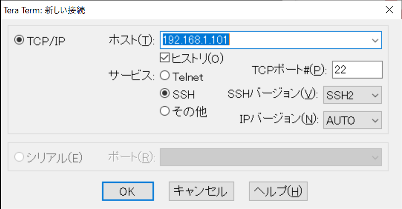

- RaspberryPi 上のアカウント（pi）でログイン

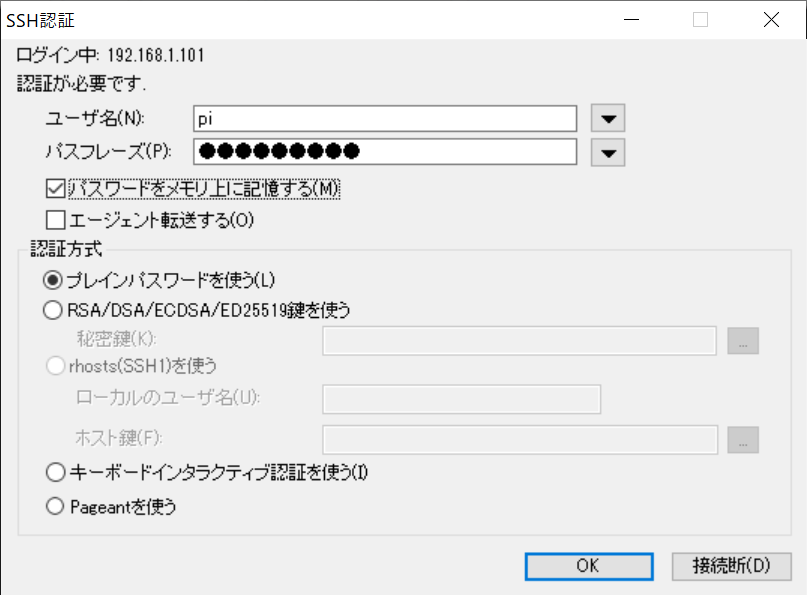

- 初回のみセキュリティ警告が出てくるので\[続行\]を押してください

- ログインに成功すればコマンドプロンプトが出てきます．

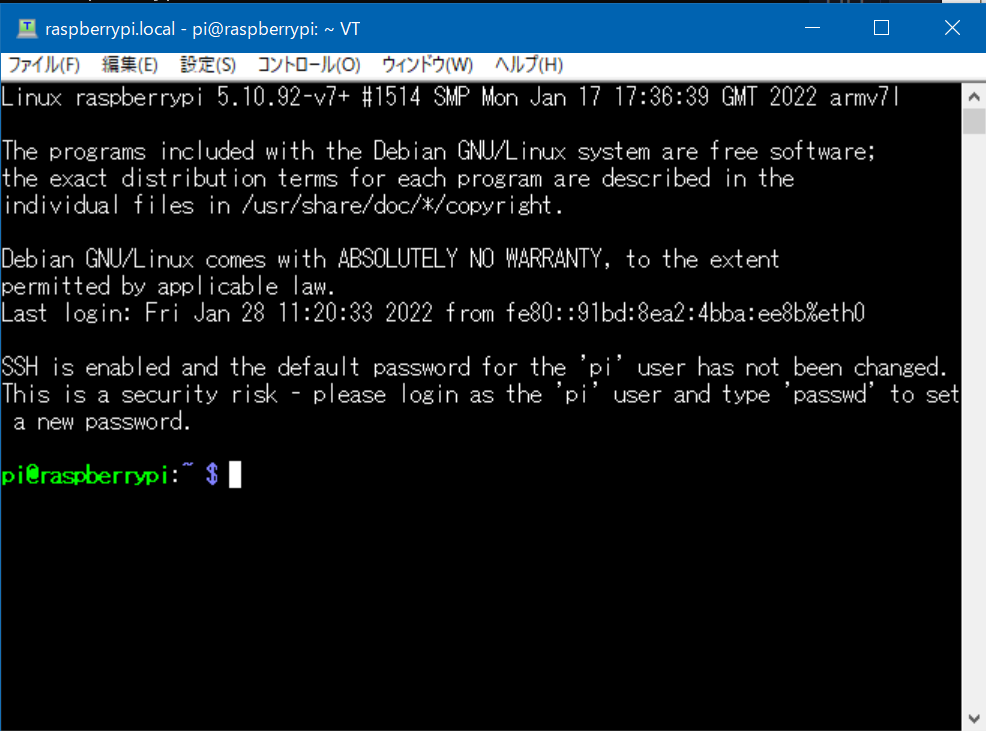

### RaspberryPi へのファイル転送

WinSCP を起動します． ログイン画面が開くので新規のホストを設定しログインします．

- 転送プロトコル: SFTP
- ホスト名: raspberrypi.local
- ユーザ名: pi
- パスワード: 設定したパスワード

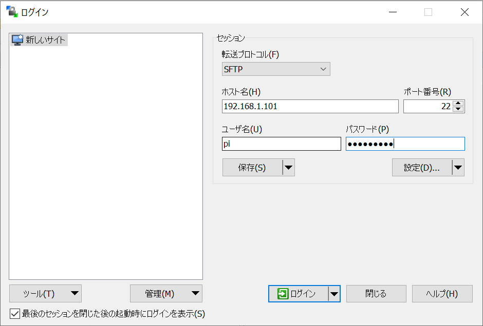

最初にアクセスした時のみセキュリティ警告が出ますので OK してください．

エクスプローラのようにドラッグ＆ドラップや右クリックメニューでファイルの転送や操作が可能です．

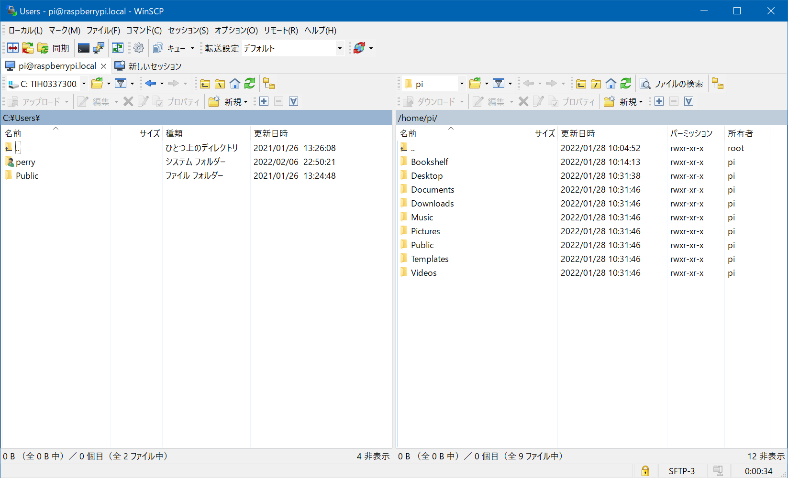

### VM から RaspberryPi への接続の確認

#### VM 環境の準備

- 前提として、[Virtual Box と VM の準備](./VirtualBox_preparation)で事前に準備を行っているかと思います．

#### VM 環境から RaspberryPi への SSH 接続の確認

VM 上の Linux のターミナルを開いて，RaspberryPi に Ping を送って通信状態を確認します．

```shell
 $ ping raspberrypi.local
```

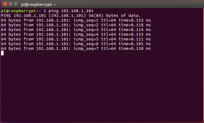

SSH で RaspberryPi にログインします．VM 上の Linux とユーザ名が異なりますので，明示的にログインユーザ名を指定してください（`-l pi` ）．

最初の接続のみ，ホスト鍵を受け入れるか聞かれますので "yes" とします．

```shell
 $ slogin raspberrypi.local -l pi
```

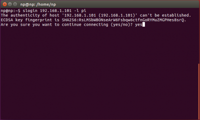

ユーザ名とパスワードが一致すれば，ログインできます．

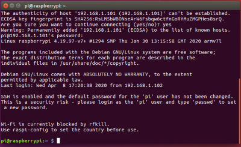

### VM 上の Linux に PC からファイルを転送

ホスト OS（Windows）からゲスト OS（Linux）にファイルを転送します．

ゲスト OS 上に ssh server が起動していることが前提となりますので，インストールされていない場合は以下のコマンドでインストールします．

```shell
 $ sudo apt-get update
 $ sudo apt-get install openssh-server
```

VirtualBox のメニューから「仮想マシン」→「設定」を開きます．

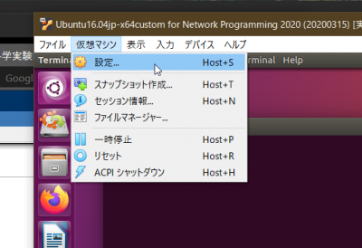

ネットワークの設定から「高度」タブを開き「ポートフォワーディング」を開きます．

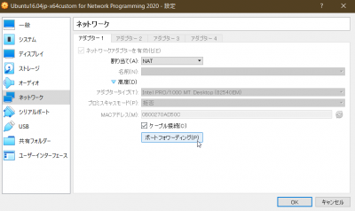

右上のアイコンをクリックして，フォワーディングルールを追加します．

ここでは，ホスト OS（Windows）のポート 22 への接続をゲスト OS（Linux）のポート 22 に転送する設定を行います．

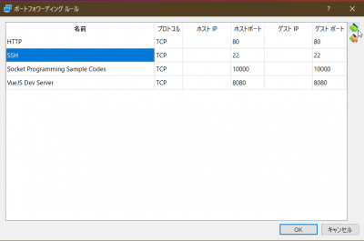

WinSCP を起動し，接続先のホストとして以下の指定して接続します．

- ホスト名: localhost
- ユーザ名: ゲスト OS に設定したユーザ名
- パスワード: ゲスト OS に設定したパスワード

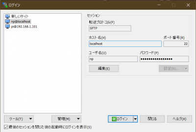

#### 外部から接続する場合

VirtualBox の設定上は外部から SSH 接続できる設定ですが，実際には Windows ファイアウォールが接続を遮断して接続できない場合がありますので注意してください．

例えば，RaspberryPi から Windows のイーサネットアダプタに設定した IP アドレスへ SSH 接続を試みると，ポートフォワーディング設定並びに，ユーザ名・パスワードが正しければログインできるはずですが，ログインできない場合があります，

```shell
 $ slogin raspberrypi.local -l XXXX （Linux上のユーザ名）
```

この場合，Windows ファイアウォールの設定を行えば接続が可能になりますが，セキュリティ上のリスクを伴いますので無理に行う必要はありません． 実験では，RaspberryPi 側をサーバプログラム，PC 上のゲスト OS 側をクライアントプログラムとして実験を進めてください．

### テキストエディタを使った接続 (任意)

テキストエディタ Atom を用いて開発環境の構築を行います.
興味のある方は実施してみてください.

なお, 上記の SSH 接続や WinSCP の設定などが済んでいることを前提として話を進めていきます.
必ず上記の SSH 接続や WinSCP の設定を済ましてから取り組んでください.

[Atom を使った環境構築](./environment_building_with_atom)
