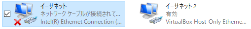

# RaspberryPi の接続

## 概要

ディスプレイとマウス・キーボードがない状態でRaspberryPiへ接続する方法を説明します．
最終的な構成は以下のようになります．

```{image} ../../../images/part1/part1_1/configuration.png
:alt: RaspberryPiの接続
:width: 400px
:align: center
```

実験中は基本的にこの形式で接続を行ってもらいます．

## 前準備

本項では[環境構築及び動作確認](../../preparation/preparation)が完了している前提で作業を行います．まだであれば先に[環境構築及び動作確認](../../preparation/preparation)を行ってください．RaspberryPiへの接続はmDNSを用いてドメイン名で行います．これらについては説明しないため，詳しく知りたい人はavahi daemonやmDNSで調べてみてください．RaspberryPiの初期設定は以下のようになっています．

- ユーザ名: pi
- パスワード: raspberry

以降，説明においては，RaspberryPiへの接続はこのユーザー名とパスワードを用いていきます．当然ですが，初期設定のままでは他の人もあなたのRaspberry Piにこのパスワードで接続が行えてしまい大変危険ですので，すぐにパスワードを変更しておきましょう．

### RaspberryPi と PC の有線ケーブルでの P2P 接続

RaspberryPi の microUSB 端子に電源を接続します．


RaspberryPi と PC を LAN ケーブルで直結します（以下の例では USB 接続の LAN アダプタを使っていますが，PC に備え付けの有線 LAN ポートがあればそれに接続します）．


```{admonition} モニタを繋ぎたい方向け情報
Raspberry Piは「 **microUSB 端子に電源を接続する前に** 」HDMIケーブルを接続しないとモニタを認識しません．モニタに画面が映らないと悩んでいる方はまずチェックしてください
```

### Windowsのネットワークアダプター設定

Windowsで設定を開き，ネットワークとインターネット＞状態を選択してください．下までスクロールすると，「アダプターのオプションを変更する」という項目が見えると思いますので，クリックしてください．


ここまでの設定が順調であればイーサネットが2つ表示されていると思います．



人によってはイーサネット名が異なりますが，以下の2つがあればOKです．

- PCに付属されているEthernetアダプター（上記だと，Intel(R) Ethernet Connection I219-V）
- VirtualBox Host-Only Ethernet Adapter

```{caution}
VirtualBox Host-Only Ethernet Adapterが表示されない場合は，VirtualBoxのバージョンが低い可能性があります．VirtualBox自体のバージョン更新または，最新版の再インストールをしてみてください．再インストールする場合は，コントロールパネルからアンインストールすることでVMのイメージを残したまま実行できます．
```

右クリックし，プロパティ＞インターネットプロトコル バージョン4(TCP/IP)を選択，その下に表示されているプロパティをクリックしてください．


チェックボックスで下記の項目が選択されているか確認してください．そうなっていなければ下記の項目を選択してください．

- IPアドレスを自動的に取得する
- DNSサーバーのアドレスを自動的に取得する


```{important}
以上の操作を2つのイーサネット両方に対して行ってください．
```

### RaspberryPiとの接続確認

コマンドプロンプトから RaspberryPi の IP アドレスに ping を実行し，接続を確認してください．

```
$ ping raspberrypi.local
```

## PC と Raspberry Pi の接続

### PC と RaspberryPi への VNC による接続

#### VNC Client による接続

VNC を起動し，RaspberryPi の ドメイン名 ( raspberrypi.local ) に接続します．


初回のみセキュリティ警告が出ますので Continue します．

ユーザ名とパスワードを入力します．


デスクトップ画面にログインできます．


#### パスワードの変更

初期パスワードのままではセキュリティ上問題がありますので，パスワード変更を行います．ターミナルを開いて，以下のコマンドでパスワード変更をしてください．パスワード変更はコンソールログイン，VNC 接続や SSH 接続，sudo でのコマンド実行など全てに影響します．

```{important}
ここで設定したパスワードを忘れると復旧は難しいので特に注意してください．
```

```shell
 $ passwd
```

#### 無線 LAN の設定

```{important}
大学のネットワークはWPA2-Enterpriseを使用しているため実験機材（Raspberry Pi 3B）からは無線接続が困難です．ソフトウェアのアップデート等でインターネットへの接続が必要となる場合には手動で有線を繋ぎ変えて接続を行ってください（どうしても無線を使いたい場合は[ここ](https://blog.cles.jp/item/12794)などを参照すると良いかもしれません）
```

RaspberryPiは配布時点の環境が最新版とは限りません．実験では PC と接続している有線/無線 LAN ネットワークを利用しますので，脆弱性対策の観点から実験実施時はこまめにアップデートを行うようにしてください．

```shell
$ sudo apt update
$ sudo apt upgrade
```

また，右上に表示されているアイコンから無線LAN設定を行うことができます．各自接続するWifiの設定を行ってください．


### SSH クライアントのインストール

RaspberryPi へのファイル転送には SSH プロトコルを利用します．SSH プロトコルはターミナル接続用途にもファイル転送用途にも利用できます（通信アプリケーションは異なります）．

#### Windows を使う場合

Web アプリケーション開発に必要なソフトは 3 つです

- SSH (ターミナル接続)
  - お勧め:Putty [https://www.putty.org/](https://www.putty.org/)
  - （お勧め:TeraTerm [https://osdn.net/projects/ttssh2/releases/](https://osdn.net/projects/ttssh2/releases/) ）
- SCP (ファイル転送)
  - お勧め：WinSCP [http://winscp.net/eng/docs/lang:jp](http://winscp.net/eng/docs/lang:jp)

#### Linux を使う場合

- SSH (ターミナル接続)
  - 大抵の場合標準で使用できます．コマンドラインから ssh と打ってみてください．
  - [http://itpro.nikkeibp.co.jp/article/COLUMN/20060227/230889/](http://itpro.nikkeibp.co.jp/article/COLUMN/20060227/230889/)
- SCP (ファイル転送)
  - 大抵の場合標準で使用できます．コマンドラインから scp と打ってみてください．
  - [http://itpro.nikkeibp.co.jp/article/COLUMN/20060227/230878/](http://itpro.nikkeibp.co.jp/article/COLUMN/20060227/230878/)

### RaspberryPi へのターミナル接続

Windows 環境からの接続を例に説明します．

- TeraTerm を起動，RaspberryPi の ドメイン（`raspberrypi.local`）を入力して SSH で接続


- RaspberryPi 上のアカウント（pi）でログイン


- 初回のみセキュリティ警告が出てくるので\[続行\]を押してください

- ログインに成功すればコマンドプロンプトが出てきます．


### RaspberryPi へのファイル転送

WinSCP を起動します． ログイン画面が開くので新規のホストを設定しログインします．

- 転送プロトコル: SFTP
- ホスト名: raspberrypi.local
- ユーザ名: pi
- パスワード: 設定したパスワード


最初にアクセスした時のみセキュリティ警告が出ますので OK してください．

エクスプローラのようにドラッグ＆ドラップや右クリックメニューでファイルの転送や操作が可能です．


## VMからRaspberryPiへの接続

VMからRaspberryPiへ接続する方法はいくつかの手段がありますが，ここではリンクローカルアドレスを用いた有線による簡易的な接続方法について説明します（他の方法を試したい方は各自で調べてみてください）．

### openssh-serverのインストール

ネットワーク設定を変更する前にVMを起動してください。
後に行う作業にてssh server が起動していることが前提となりますので，インストールされていない場合は以下のコマンドでインストールします．

```shell
 $ sudo apt-get update
 $ sudo apt-get install openssh-server
```

作業が終了したらVMの設定を変更しますのでシャットダウンしてください。

### VMのネットワーク設定

VirtualBoxを開いて，事前準備で構築したVMを選択し，設定を開きます．ネットワーク設定からアダプター1を選択し，割り当てをブリッジアダプタ―に，名前は[Windowsのネットワークアダプタ設定](./connect_raspberry.html#windows)で確認した二つのイーサネットのうち「VirtualBox Host-Only Ethernet Adopter」**ではない方**を選択し,OKを押してください．


次に選択したVMを起動し，右上のメニューをクリックして有線接続中＞有線設定を選択してください．（有線接続中ではなく，有線オフの場合もあります）


有線欄の歯車マークを選択します．


IPv4>リンクローカルのみにチェックを入れ，適用を押してください．


設定適用までしばらく時間がかかりますが，ターミナルで`ip a`を打ち込み，下記のように`169.254`から始まるアドレスが確認できれば設定完了です．


### VM から RaspberryPi への接続の確認

VM 上の Linux のターミナルを開いて，RaspberryPi に Ping を送って通信状態を確認します．

```shell
 $ ping raspberrypi.local
```


SSH で RaspberryPi にログインします．

```shell
 $ ssh pi@raspberrypi.local
 ```

最初の接続のみ，ホスト鍵を受け入れるか聞かれますので "yes" と打ち込みenterを押してください．
ユーザ名とパスワードが一致すれば，ログインできます．


SSH接続時に`exit`を打ち込むことで，SSH接続を切ることができます．

```shell
$ exit
```

### VM 上の Linux に PC からファイルを転送

ホスト OS（Windows）からゲスト OS（Linux）にファイルを転送します．

以下のコマンドでIPアドレスを確認しておいてください．

```shell
$ ip a
```


上記の例では接続するIPアドレスは`169.254.161.171`です．
WinSCP を起動し，接続先のホストとして以下の指定をして接続します．

- ホスト名: 先ほど確認したIPアドレス
- ユーザ名: ゲスト OS に設定したユーザ名
- パスワード: ゲスト OS に設定したパスワード


```{important}
接続するIPアドレスは起動毎に変わる可能性があります．WinSCPで接続する際は事前にVM上でIPアドレスを確認してください．
```

#### 外部から接続する場合

```{important}
VirtualBox の設定上は外部から SSH 接続できる設定ですが，実際には Windows ファイアウォールが接続を遮断して接続できない場合がありますので注意してください．
```

例えば，RaspberryPi から Windows のイーサネットアダプタに設定した IP アドレスへ SSH 接続を試みると，ユーザ名・パスワードが正しければログインできるはずですが，ログインできない場合があります，

```shell
 $ slogin <VMのIP> -l <VMのユーザー名>
```

この場合，Windows ファイアウォールの設定を行えば接続が可能になりますが，セキュリティ上のリスクを伴いますので無理に行う必要はありません． 実験では，RaspberryPi 側をサーバプログラム，PC 上のゲスト OS 側をクライアントプログラムとして実験を進めてください．

## うまくいかない時のトラブルシューティング

- windows→raspberrypi.localでpingが通らない
  - Windows上からIPv4オプションをつけてpingを実行する
    - `ping -4 169.254.xx.xx`
- VM→raspberrypi.localでpingが通らない
  - VirtualBoxを最新版に更新or再インストール
- PC→VMへのファイル転送ができない(pingが通らない)
  - Windows11の場合やに多数の事例あり
    - DNSキャッシュをクリアにしてもう一度試す
      - `ipconfig /flushdns`
    - VMのMACアドレスを変更する
    - pingを送り続ける
    - VMとPCの再起動を繰り返す
- 特定の場合に限らず
  - Windows, RaspberryPiをそれぞれ再起動

## テキストエディタを使った接続 (任意)

テキストエディタ Atom を用いて開発環境の構築を行います．
興味のある方は実施してみてください．

なお， 上記の SSH 接続や WinSCP の設定などが済んでいることを前提として話を進めていきます．
必ず上記の SSH 接続や WinSCP の設定を済ましてから取り組んでください．

[Atom を使った環境構築](./environment_building_with_atom)
