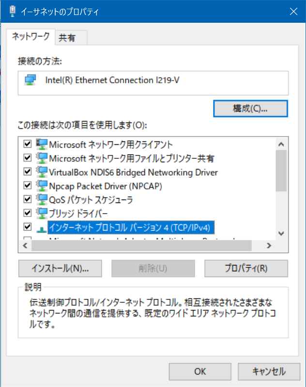

# RaspberryPiの接続（固定IP）

## 概要

実験室以外で実験を行う場合に，ディスプレイとマウス・キーボードがない状態でRaspberryPiへ接続する方法を説明します．

情報科学実験Iで配布したRaspberryPiはEthernetデバイスに固定IP（192.168.1.101）を設定してありますので，それを前提としてPCから接続します．

最終的な構成は以下のようになります．

```{image} ../../../images/part1/part1_1/configuration.png
:alt: RaspberryPiの接続
:width: 400px
:align: center
```

実験中は基本的にこの形式で接続を行ってもらいます．

## 前準備

本項では[環境構築及び動作確認](../../preparation/preparation)が完了している前提で作業を行います．まだであれば先に[環境構築及び動作確認](../../preparation/preparation)を行ってください．RaspberryPiへの接続はmDNSを用いてドメイン名で行います．これらについては説明しないため，詳しく知りたい人はavahi daemonやmDNSで調べてみてください．RaspberryPiの初期設定は以下のようになっています．

- ユーザ名: pi
- パスワード: raspberry

以降，説明においては，RaspberryPiへの接続はこのユーザー名とパスワードを用いていきます．当然ですが，初期設定のままでは他の人もあなたのRaspberry Piにこのパスワードで接続が行えてしまい大変危険ですので，すぐにパスワードを変更しておきましょう．

## RaspberryPiとPCの有線ケーブルでのP2P接続

RaspberryPiのmicroUSB端子に電源を接続します．


RaspberryPiとPCをLANケーブルで直結します（以下の例ではUSB接続のLANアダプタを使っていますが，PCに備え付けの有線LANポートがあればそれに接続します）．


```{admonition} モニタを繋ぎたい方向け情報
Raspberry Piは「 **microUSB 端子に電源を接続する前に** 」HDMIケーブルを接続しないとモニタを認識しません．モニタに画面が映らないと悩んでいる方はまずチェックしてください
```

## IPアドレスと接続の確認

WindowsPC上のイーサネットデバイスにRaspberryPiと同じサブネットワークのIPアドレス（192.168.1.102）を設定します．

ただし，Windows上で複数のイーサネットデバイスを認識している場合がありますので（特にVirtualBoxなどのVM環境を構築している場合は仮想イーサネットデバイスが存在するはず），RaspberryPiと接続したイーサネットデバイスを確認してから作業を進めてください．

### PCの有線LANデバイスにIPアドレスを設定

Windowsで設定を開き，ネットワークとインターネット＞状態を選択してください．下までスクロールすると，「アダプターのオプションを変更する」という項目が見えると思いますので，クリックしてください．


RaspberryPiと接続したイーサネットデバイスのプロパティを開きます．


インターネットプロトコルバージョン4（TCP/IPv4）のプロパティを開きます．



IPアドレスとサブネットマスクを設定します．

- IPアドレス:192.168.1.102
- サブネットマスク:255.255.255.0


コマンドプロンプトからipconfigコマンドを実行し，IPアドレスとサブネットマスクが設定されたものであるか確認してください．

```shell
$ipconfig

イーサネット アダプター イーサネット 2:
…
   IPv4 アドレス . . . . . . . . . . . .: 192.168.1.102
   サブネット マスク . . . . . . . . . .: 255.255.255.0
```

### RaspberryPiとの接続確認

コマンドプロンプトからRaspberryPiのIPアドレスにpingを実行し，正しく応答があるか確認してください．

```shell
$ping 192.168.1.101

192.168.1.101 に ping を送信しています 32 バイトのデータ:
192.168.1.101 からの応答: バイト数 =32 時間 =18ms TTL=64
192.168.1.101 からの応答: バイト数 =32 時間 =1ms TTL=64
192.168.1.101 からの応答: バイト数 =32 時間 =1ms TTL=64
192.168.1.101 からの応答: バイト数 =32 時間 =1ms TTL=64

192.168.1.101 の ping 統計:
    パケット数: 送信 = 4、受信 = 4、損失 = 0 (0% の損失)、
ラウンド トリップの概算時間 (ミリ秒):
    最小 = 1ms、最大 = 18ms、平均 = 5ms
```

## PCからRaspberryPiへのVNCによる接続

### VNCClientによる接続

VNCを起動し，RaspberryPiのIPアドレス(192.168.1.101)に接続します．

- ユーザ名:pi
- パスワード:raspberry


初回のみセキュリティ警告が出ますがContinueを押し，ユーザ名とパスワードを入力します．


デスクトップ画面にログインできます．


### パスワードの変更

初期パスワードのままではセキュリティ上問題がありますので，パスワード変更を行います．ターミナルを開いて，以下のコマンドでパスワード変更をしてください．パスワード変更はコンソールログイン，VNC接続やSSH接続，sudoでのコマンド実行など全てに影響します．ここで設定したパスワードを忘れると復旧は難しいので特に注意してください．

```{important}
ここで設定したパスワードを忘れると復旧は難しいので特に注意してください．
```

```shell
$passwd
```

### 無線LANの設定

大学のネットワークはWPA2-Enterpriseを使用しているため実験機材（Raspberry Pi 3B）からは無線接続が困難です．（どうしても大学のネットワークで無線を使いたい場合は[ここ](https://blog.cles.jp/item/12794)などを参照すると良いかもしれません）

本講義では作業簡略化のため**実験用の仮ネットワークを用意しておりますので担当教員からのパスワードなどの情報開示をお待ちください．**

右上に表示されているアイコンから無線LAN設定を行うことができます．各自接続するWifiの設定を行ってください．


RaspberryPiは配布時点の環境が最新版とは限りません．実験では PC と接続している有線/無線 LAN ネットワークを利用しますので，脆弱性対策の観点から実験実施時はこまめにアップデートを行うようにしてください．

```shell
$sudo apt update
$sudo apt upgrade
```

## SSHクライアントのインストール

RaspberryPiへのファイル転送にはSSHプロトコルを利用します．SSHプロトコルはターミナル接続用途にもファイル転送用途にも利用できます（通信アプリケーションは異なります）．

### Windowsを使う場合

Webアプリケーション開発に必要なソフトは3つです

- SSH(ターミナル接続)
  - お勧め:Putty[https://www.putty.org/](https://www.putty.org/)
  - （お勧め:TeraTerm[https://osdn.net/projects/ttssh2/releases/](https://osdn.net/projects/ttssh2/releases/)）
- SCP(ファイル転送)
  - お勧め：WinSCP[http://winscp.net/eng/docs/lang:jp](http://winscp.net/eng/docs/lang:jp)

### Linuxを使う場合

- SSH(ターミナル接続)
  - 大抵の場合標準で使用できます．コマンドラインからsshと打ってみてください．
  - [http://itpro.nikkeibp.co.jp/article/COLUMN/20060227/230889/](http://itpro.nikkeibp.co.jp/article/COLUMN/20060227/230889/)
-SCP(ファイル転送)
  - 大抵の場合標準で使用できます．コマンドラインからscpと打ってみてください．
  - [http://itpro.nikkeibp.co.jp/article/COLUMN/20060227/230878/](http://itpro.nikkeibp.co.jp/article/COLUMN/20060227/230878/)

## RaspberryPiへのターミナル接続

Windows環境からの接続を例に説明します．

TeraTermを起動，RaspberryPiのIPアドレス（192.168.1.101）を入力してSSHで接続


RaspberryPi上のアカウント（pi）でログイン


初回のみセキュリティ警告が出てくるので\[続行\]を押します．ログインに成功すればコマンドプロンプトが出てきます．

## RaspberryPiへのファイル転送

WinSCPを起動します．ログイン画面が開くので新規のホストを設定しログインします．

- 転送プロトコル:SFTP
- ホスト名:192.168.1.101
- ユーザ名:pi
- パスワード:設定したパスワード


最初にアクセスした時のみセキュリティ警告が出ますのでOKします．エクスプローラのようにドラッグ＆ドラップや右クリックメニューでファイルの転送や操作が可能です．

## VMからRaspberryPiへの接続の確認

VMからRaspberryPiへ接続する方法はいくつかの手段がありますが，ここではリンクローカルアドレスを用いた有線による簡易的な接続方法について説明します（他の方法を試したい方は各自で調べてみてください）．

### openssh-serverのインストール

ネットワーク設定を変更する前にVMを起動してください。
後に行う作業にてssh server が起動していることが前提となりますので，インストールされていない場合は以下のコマンドでインストールします．

```shell
 $sudo apt-get update
 $sudo apt-get install openssh-server
```

### VM環境からRaspberryPiへのSSH接続の確認

VM上のLinuxのターミナルを開いて，RaspberryPiにPingを送って通信状態を確認します．

```shell
$ping 192.168.1.101
```

SSHでRaspberryPiにログインします．最初の接続のみ，ホスト鍵を受け入れるか聞かれますので"yes"とします．

```shell
 $ssh pi@192.168.1.101
 ```

ユーザ名とパスワードが一致すれば，ログインできます．SSH接続中は`exit`を打ち込むことで，SSH接続を切ることができます．

```shell
$exit
```

## VM上のLinuxにPCからファイルを転送

ホストOS（Windows）からゲストOS（Linux）にファイルを転送します．

VirtualBoxのメニューから「仮想マシン」→「設定」を開きます．


ネットワークの設定から「高度」タブを開き「ポートフォワーディング」を開きます．


右上のアイコンをクリックして，フォワーディングルールを追加します．ここでは，ホストOS（Windows）のポート22への接続をゲストOS（Linux）のポート22に転送する設定を行います．


WinSCPを起動し，接続先のホストとして以下の指定して接続します．

- ホスト名:localhost
- ユーザ名:ゲストOSに設定したユーザ名
- パスワード:ゲストOSに設定したパスワード


### 外部から接続する場合

```{important}
VirtualBox の設定上は外部から SSH 接続できる設定ですが，実際には Windows ファイアウォールが接続を遮断して接続できない場合がありますので注意してください．
```

例えば，RaspberryPiからWindowsのイーサネットアダプタに設定したIPアドレスへSSH接続を試みると，ポートフォワーディング設定並びに，ユーザ名・パスワードが正しければログインできるはずですが，ログインできない場合があります，

```shell
$ssh <VMのユーザー名>@<VMのIP>
```

この場合，Windowsファイアウォールの設定を行えば接続が可能になりますが，セキュリティ上のリスクを伴いますので無理に行う必要はありません．実験では，RaspberryPi側をサーバプログラム，PC上のゲストOS側をクライアントプログラムとして実験を進めてください．

## テキストエディタを使った接続(任意)

テキストエディタAtomを用いて開発環境の構築を行います.
興味のある方は実施してみてください.

なお,上記のSSH接続やWinSCPの設定などが済んでいることを前提として話を進めていきます.
必ず上記のSSH接続やWinSCPの設定を済ましてから取り組んでください.

[Atomを使った環境構築](./environment_building_with_atom)
