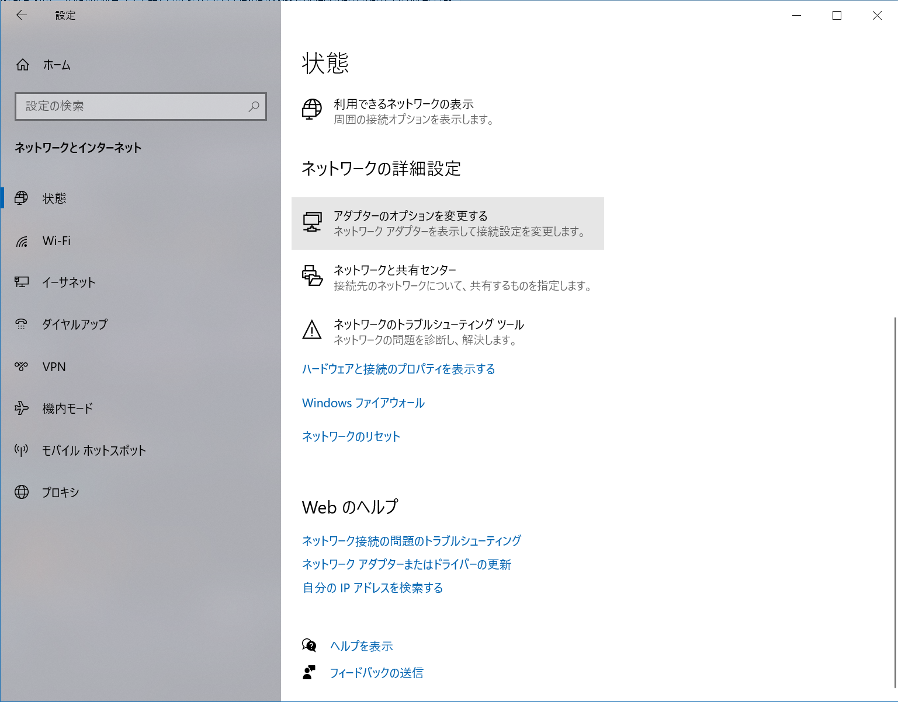
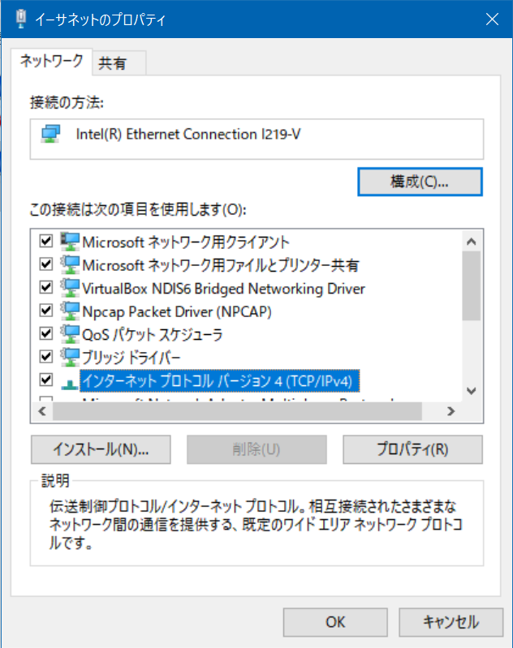
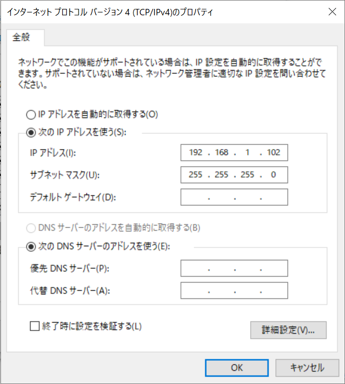

# モニタがない状況でのRaspberryPiの接続（任意）

実験室以外で実験を行う場合に，モニタとマウス・キーボードがない状態でRaspberryPiへ接続する方法を説明します．

モニタなどの周辺機器がない場合、RaspberryPiを操作してIPアドレスを確認することができません．情報科学実験Aで配布したRaspberryPiはEthernetデバイスに固定IP（`192.168.1.101`）を設定してありますので，このIPアドレスをモニタがある状況下で確認するIPアドレスの代わりに使用します．このような周辺機器のない状況下で実験を行う場合実験サイトに記載されているRaspberryPiのIPアドレスは`192.168.1.101`に読み替えて実施してください．

最終的な構成は以下のようになります．

```{image} ../../../images/part1/part1_1/configuration.png
:alt: RaspberryPiの接続
:width: 400px
:align: center
```

RaspberryPiとPCをLANケーブルで直結します（以下の例ではUSB接続のLANアダプタを使っていますが，PCに備え付けの有線LANポートがあればそれに接続します）．


## IPアドレスと接続の確認

WindowsPC上のイーサネットデバイスにRaspberryPiと同じサブネットワークのIPアドレス（`192.168.1.102`）を設定します．

ただし，Windows上で複数のイーサネットデバイスを認識している場合がありますので（特にVirtualBoxなどのVM環境を構築している場合は仮想イーサネットデバイスが存在するはず），RaspberryPiと接続したイーサネットデバイスを確認してから作業を進めてください．

### PCの有線LANデバイスにIPアドレスを設定

Windowsで設定を開き，ネットワークとインターネット＞状態を選択してください．下までスクロールすると，「アダプターのオプションを変更する」という項目が見えると思いますので，クリックしてください．



RaspberryPiと接続したイーサネットデバイスのプロパティを開きます．


インターネットプロトコルバージョン4（TCP/IPv4）のプロパティを開きます．



IPアドレスとサブネットマスクを設定します．

- IPアドレス:`192.168.1.102`
- サブネットマスク:`255.255.255.0`



コマンドプロンプトからipconfigコマンドを実行し，IPアドレスとサブネットマスクが設定されたものであるか確認してください．

```shell
$ipconfig

イーサネット アダプター イーサネット 2:
…
   IPv4 アドレス . . . . . . . . . . . .: 192.168.1.102
   サブネット マスク . . . . . . . . . .: 255.255.255.0
```

### RaspberryPiとの接続確認

コマンドプロンプトからRaspberryPiのIPアドレスにpingを実行し，正しく応答があるか確認してください．

```shell
$ping 192.168.1.101

192.168.1.101 に ping を送信しています 32 バイトのデータ:
192.168.1.101 からの応答: バイト数 =32 時間 =18ms TTL=64
192.168.1.101 からの応答: バイト数 =32 時間 =1ms TTL=64
192.168.1.101 からの応答: バイト数 =32 時間 =1ms TTL=64
192.168.1.101 からの応答: バイト数 =32 時間 =1ms TTL=64

192.168.1.101 の ping 統計:
    パケット数: 送信 = 4、受信 = 4、損失 = 0 (0% の損失)、
ラウンド トリップの概算時間 (ミリ秒):
    最小 = 1ms、最大 = 18ms、平均 = 5ms
```

## VNCClientによる接続

VNCを起動し，RaspberryPiのIPアドレス(`192.168.1.101`)に接続します．

- ユーザ名:pi
- パスワード:raspberry


初回のみセキュリティ警告が出ますがContinueを押し，ユーザ名とパスワードを入力します．


デスクトップ画面にログインできます．


