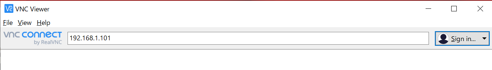

# RaspberryPiの有線接続

実験室以外で実験を行う時，モニタやマウス・キーボードがなくIPを確認できないことがあります．このような場合にRaspberryPiへ接続できるようにします．

皆さんは実験室で作業をしているはずなので目の前にモニタなどがありますが，自宅などで作業を行うときは機材が十分に揃っていないことがあるかと思います．このような状況下でも作業ができるように，LANケーブルのみで接続できるような有線接続のための設定をしておくと便利です

最終的な構成は以下のようになります．

```{image} ../../../images/part1/part1_1/configration_wired.png
:alt: RaspberryPiの接続
:width: 400px
:align: center
```

## RaspberryPiの有線LANデバイスにIPアドレスを設定

情報科学実験Aで配布したRaspberryPiのEthernetデバイスに固定IP（`192.168.1.101`）を設定します．

RaspberryPiで`/etc/dhcpcd.conf`を開いてください．下記のような`# interface eth0`から始まる記述を探します．

```text
# interface eth0
# static ip_address=192.168.0.10/24
# static ip6_address=fd51:42f8:caae:d92e::ff/64
# static routers=192.168.0.1 8.8.8.8 fd51:42f8:caae:d92e::1
```

全ての行頭から`#`を削除し，`static ip_address`の項目を`192.168.1.101`に，`static routers`の項目を`192.168.1.1`に書き換えてください

```text
interface eth0
static ip_address=192.168.1.101/24
static ip6_address=fd51:42f8:caae:d92e::ff/64
static routers=192.168.1.1 8.8.8.8 fd51:42f8:caae:d92e::1
```

以下のコマンドを実行します．

```shell
$ sudo systemctl restart networking
```

これでRaspberryPi側の設定は完了です．以降の本資料において記載されているRaspberryPiのIPアドレスは全て無線で接続する際のIPアドレスです．よって，有線接続で実験を行う場合，実験サイトに記載されているRaspberryPiのIPアドレスは`192.168.1.101`に読み替えて実施してください．

## PCの有線LANデバイスにIPアドレスを設定

WindowsPC上のイーサネットデバイスにRaspberryPiと同じサブネットワークのIPアドレス（`192.168.1.102`）を設定します．

ただし，Windows上で複数のイーサネットデバイスを認識している場合がありますので（特にVirtualBoxなどのVM環境を構築している場合は仮想イーサネットデバイスが存在するはず），RaspberryPiと接続したイーサネットデバイスを確認してから作業を進めてください．

また，Windows 10と11で途中までの操作が異なります．それぞれの項目を参照してください．

### Windows 10の場合

Windowsで設定を開き，ネットワークとインターネット＞状態を選択してください．下までスクロールすると，「アダプターのオプションを変更する」という項目が見えると思いますので，クリックしてください．


RaspberryPiと接続したイーサネットデバイスのプロパティを開きます．


### Windows 11の場合

Windowsで設定を開き，ネットワークとインターネットを選択，下までスクロールしてネットワークの詳細設定を選択してください．


RaspberryPiと接続したイーサネットデバイスを選択し，その他のアダプターオプションを選択してください．


### 【Windows 10/11共通】イーサネットのプロパティ変更

インターネットプロトコルバージョン4（TCP/IPv4）のプロパティを開きます．


IPアドレスとサブネットマスクを設定します．

- IPアドレス:`192.168.1.102`
- サブネットマスク:`255.255.255.0`


コマンドプロンプトからipconfigコマンドを実行し，IPアドレスとサブネットマスクが設定されたものであるか確認してください．

```shell
$ ipconfig

イーサネット アダプター イーサネット 2:
…
   IPv4 アドレス . . . . . . . . . . . .: 192.168.1.102
   サブネット マスク . . . . . . . . . .: 255.255.255.0
```

## 接続確認

RaspberryPiとPCをLANケーブルで直結します（以下の例ではUSB接続のLANアダプタを使っていますが，PCに備え付けの有線LANポートがあればそれに接続します）．


コマンドプロンプトからRaspberryPiのIPアドレスにpingを実行し，正しく応答があるか確認してください．

```shell
$ ping 192.168.1.101

192.168.1.101 に ping を送信しています 32 バイトのデータ:
192.168.1.101 からの応答: バイト数 =32 時間 =18ms TTL=64
192.168.1.101 からの応答: バイト数 =32 時間 =1ms TTL=64
192.168.1.101 からの応答: バイト数 =32 時間 =1ms TTL=64
192.168.1.101 からの応答: バイト数 =32 時間 =1ms TTL=64

192.168.1.101 の ping 統計:
    パケット数: 送信 = 4、受信 = 4、損失 = 0 (0% の損失)、
ラウンド トリップの概算時間 (ミリ秒):
    最小 = 1ms、最大 = 18ms、平均 = 5ms
```

## VNCClientによる接続

VNCを起動し，RaspberryPiのIPアドレス(`192.168.1.101`)に接続します．

- ユーザ名:pi
- パスワード:raspberry



初回のみセキュリティ警告が出ますがContinueを押し，ユーザ名とパスワードを入力します．


デスクトップ画面にログインできます．


