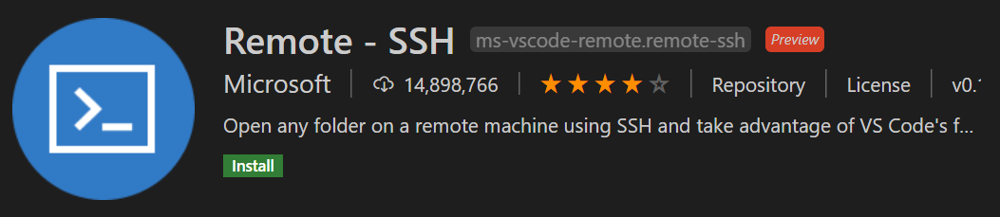
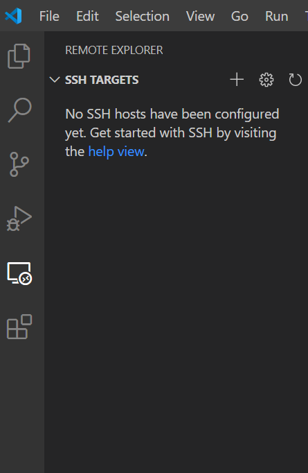
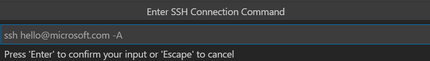
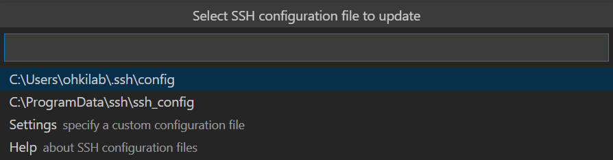
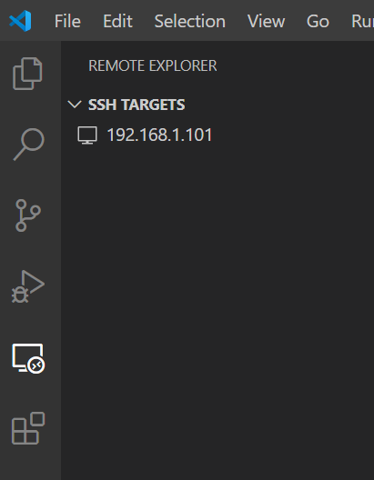
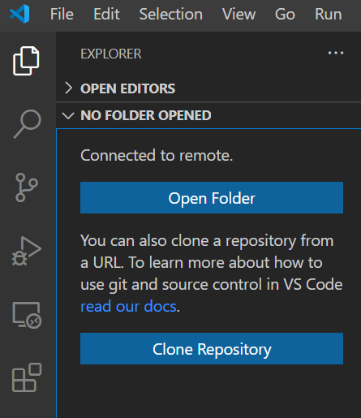

# VSCodeを使った環境構築（任意）

エディタであるVSCodeを用いて実験で用いる開発環境を整えます．[公式のダウンロードページ](https://code.visualstudio.com/download)からPCにVSCodeをダウンロードしてください．

## 各種設定

VSCodeの日本語化を行います．英語のまま利用しても構いません．

VSCodeの左に表示されているバーからExtensionsを選択してください．検索ボックスに
Japanese Language Packを選択，installを押してください

他にも便利な拡張機能はいくつもあるので，好みの拡張機能をインストールしてください．以下の表は便利な拡張機能の一部です．

```{list-table} vscode 便利な拡張機能
:header-rows: 1
:class: full-width table
:name: convenient package
* - 拡張機能名
  - 用途
* - *Remote SSH*
  - SSHサーバが稼働しているマシン上のファイルやフォルダをVSCodeで操作可能になります
* - 各言語の統合パック
  - それぞれ言語名で検索すると見つかると思います．デバック機能，フォーマット機能，解析機能などを提供しているため入れておいて損はないでしょう
* - indent-rainbow
  - インデントを見やすくしてくれます
```

## Remote-SSHの導入

Remote-sshを導入することによりSSHサーバが稼働しているマシン上のファイルやフォルダをVSCodeで操作することが可能になります．

VSCodeの左に表示されているバーから，Extensionsを選択してください．検索ボックスに
Remote-SSHを入力，該当するものを選択してinstallを押してください．



インストールが終わると左バーに新しいアイコンが追加されていると思います．選択して，画像右上に表示されているようなプラスマークを押下してください．



ウインドウ丈夫に入力欄が出てくると思います．`ssh pi@{RaspberrPiのIPアドレス}`を入力，Enterしてください．



SSHに用いる設定ファイルを聞かれます．画像では一番上の選択肢，`ユーザのホームディレクトリ\.ssh\config`を選択しています．



先程選択した左バーのRemote-SSHのアイコンを再度見て，接続先IPの選択肢を選択してください．パスワード入力を求められますのでpiユーザに設定したパスワードを入力してください．



少々時間がかかりますが，下記のような画面になったら設定終了です．操作したいファイル，フォルダを選択してください．


