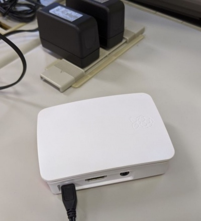

# RaspberryPiのセッティング

実験はラズパイとPCの２つの機材を用いて図のような形式で実験を行います．

```{image} ../../../images/part1/part1_1/configuration_wireless.png
:alt: RaspberryPiの接続
:width: 400px
:align: center
```

## 前準備

本項では[環境構築及び動作確認](../../preparation/preparation)が完了している前提で作業を行います．まだであれば先に[環境構築及び動作確認](../../preparation/preparation)を行ってください．

## モニタと電源の接続

Raspberry Piは「 **USB C端子に電源を接続する前に** 」HDMIケーブルを接続しないとモニタを認識しません．実験では基本モニタを用いて実施しますので必ず電源接続前にHDMIケーブルを接続するようにしましょう．

RaspberryPiのUSB C端子に電源を接続します．



## 初期設定

都合上，一部の方のRaspberryPiでは初期設定が未実施です．未実施の場合と実施済みの場合でそれぞれ実施する事項が異なるため各自参照して実施するようにしてください．

### 初期設定が未実施の場合

電源をつけるとRaspberryPiの初期設定画面が表示されます．設定項目としては以下のようなものがあります． **ユーザー名は簡略化のためpiとしてください．パスワードは適時設定し，忘れないように必ずメモをしておいてください※．** また，wifi接続とアップデートは後に実施するためスキップしてください．

```{important}
※パスワード変更はコンソールログイン，VNC接続やSSH接続，sudoでのコマンド実行など全てに影響します．ここで設定したパスワードを忘れると復旧は難しいので特に注意してメモを取るなどの対策をとってください．
```

- 言語選択
- ユーザ名，パスワード設定
- wifi接続（スキップしてください）
- アップデート（スキップしてください）

以降，講義資料内の説明においては下記ユーザー名とパスワードを用いるものとします．

### 初期設定が実施済みの場合

初期設定画面が出てこない場合は初期設定が完了しています．以下のユーザ情報を使用してログインしてください．

- ユーザ名: pi
- パスワード: raspberry

なお，デフォルトのパスワードを用いるのは辞書攻撃などに対して脆弱であるため大変危険です．ターミナル上でpasswdコマンドを用いてパスワードを変更しておきましょう．

```{important}
※パスワード変更はコンソールログイン，VNC接続やSSH接続，sudoでのコマンド実行など全てに影響します．ここで設定したパスワードを忘れると復旧は難しいので特に注意してメモを取るなどの対策をとってください．
```

## 無線LANの設定

大学のネットワークはWPA2-Enterpriseを使用しているため実験機材（Raspberry Pi 4）からは通常の方法では無線接続が困難です．
学内無線LANを利用したい方は以下の方法でセットアップを以下の方法でセットアップを行ってください．

```shell
# パスワードのハッシュを取得（静大IDに対応するパスワードを入力）
$ read -s pass
（静大IDに対応するパスワードを入力する）
$ echo -n "$pass" | iconv -t utf16le | openssl md4
（stdin）=（ハッシュ値）
# ハッシュ値をメモっておく
$ unset pass
```

/etc/wpa_supplicant/wpa_supplicant.conf に以下の内容を追記

```
network={
   ssid="WRL-SUCCES-S3"
#  ssid="eduroam" <- eduroamの時はこちら
   priority=1
   proto=RSN
   key_mgmt=WPA-EAP
   pairwise=CCMP
   auth_alg=OPEN
   eap=PEAP
   identity="静大ID"
#  identity="静大ID@shizuoka.ac.jp" <- eduroamの時はこちら
   password=hash：静大IDに対するバスワードのハッシュ値
   phase1="peaplabel=0"
   phase2="auth=MSCHAPV2"
}
```

書き換えが終わったら再起動すると接続が有効になります．


## SSH、VNCサーバの有効化

PCからRaspberryPiに接続するため，SSH，VNCを有効化します．左上のアイコンから`設定＞RaspberryPiの設定`を選択してください．


ウインドウが開くので，SSHとVNCのトグルスイッチを有効にしてください．


## 電源の切断方法

RaspberryPiの電源切断方法は2通りあります．ここで電源を切断する必要はありませんが，覚えておくと良いでしょう．

1. 画面上でシャットダウン：左上のメニュー（RaspberryPiボタン）から`ログアウト`→`Shutdown`を選択
2. ターミナルからシャットダウン：`sudo shutdown -h now`
