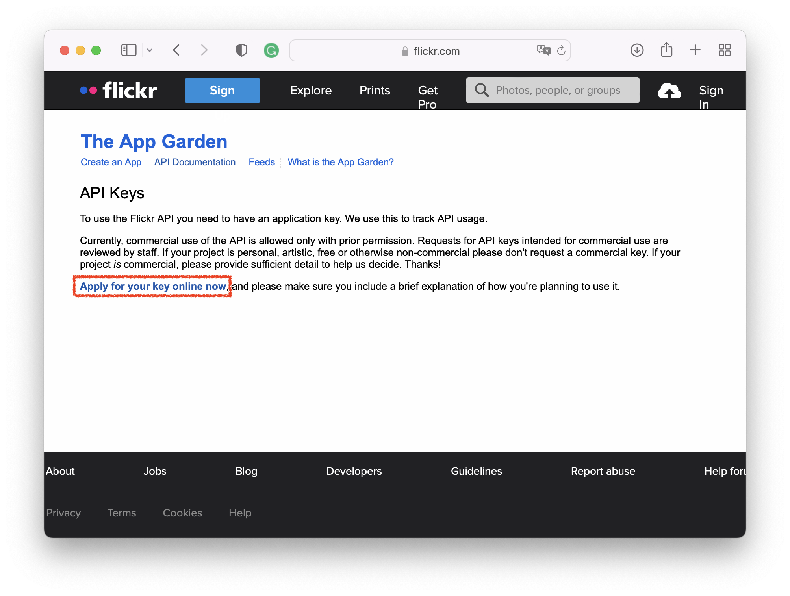
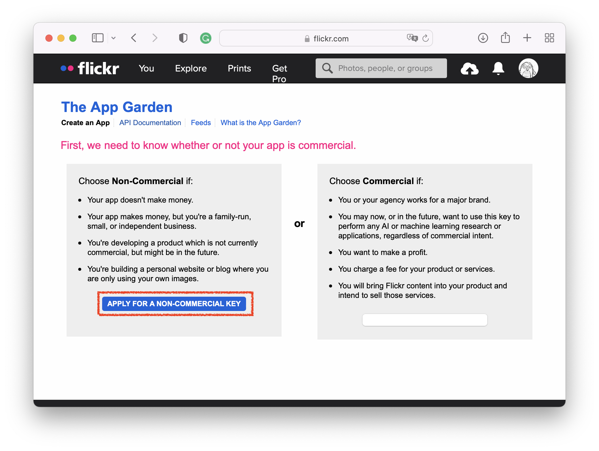
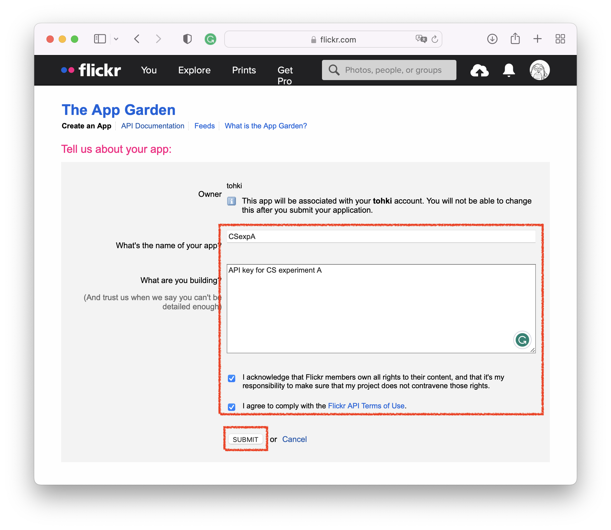
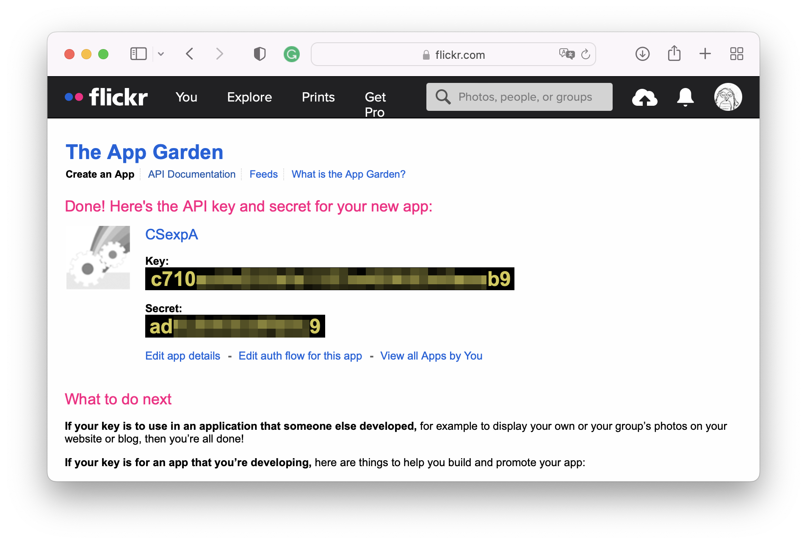

# Flickr API Keyの取得方法
ここでは自分でFlickr API Keyを取得する方法について解説します．

まず，[https://www.flickr.com/services/api/misc.api_keys.html](https://www.flickr.com/services/api/misc.api_keys.html)にアクセスし，表示された画面下部に見える**Apply for key online now**をクリックします．ログイン画面が出てくるのでアカウントを持っている人はアカウントとパスワードを入力してログインします．まだアカウントを持っていない方はアカウントを作成してください．

APIの利用用途について聞かれますので「APPLY FOR NON COMMERCIAL USE」を選択します．

APIの名前や利用用途を記載する画面になりますので，これらを入力します（画面表示は例です）．
必要に応じて適切な名前を設定してください．

最後に表示された「Key:」 に続く文字列がAPI Keyです．今回のサンプルプログラムにあるような直近の画像100件の読み出しなどはKeyのみで行うことができます．「Secret:」もKeyの一種ですが，写真の投稿や削除など
より権限を必要とするAPI処理を実行することが可能です．
