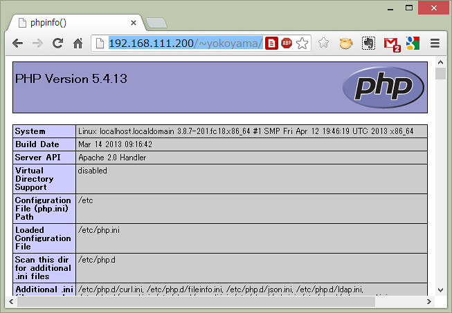
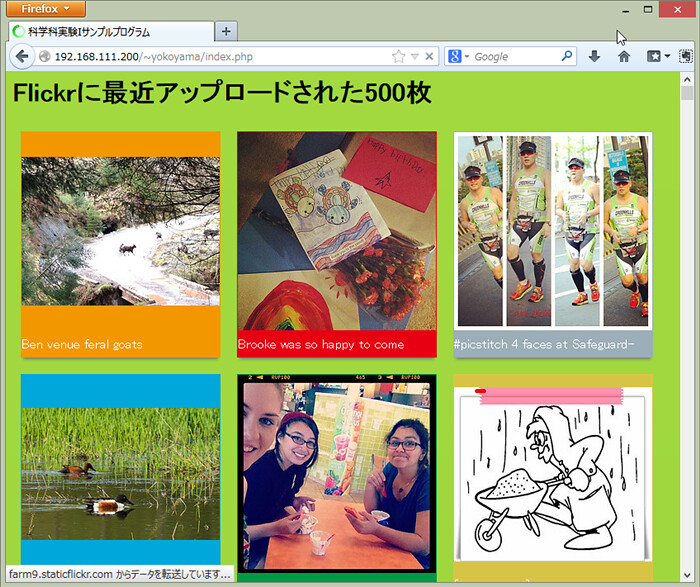

# サンプルプログラム(PHP)

## はじめに

Webシステムを構築する上で重要となるWebサーバについて，Node.jsを用いたWebサーバを試してみました．次は，代表的なWebサーバ用ソフトウェアであるApacheを用いて，PHPで作成されるWebページを返すような単純なWebシステムを構築してみましょう．

## PHPの動作確認

まず，サーバ端末上の皆さんのホームディレクトリにあるpublic\_htmlディレクトリにあるファイルへ，Webブラウザで表示できるようにUserdir設定を有効にしてください． public\_html ディレクトリがない方や，userdirの設定が終わっていない方は，第二部 [Raspberry\_Piのセットアップ](../../part2/part2_1/raspberrypi_setup "Raspberry Piのセットアップ") を参照してください．

次に，サーバ端末上の皆さんのホームディレクトリにあるpublic\_htmlディレクトリへ，以下のような内容で`index.php`というPHPファイルを作成してみてください．もちろんサーバ端末へリモートログインしてファイル作成しても構いませんが，ローカルのノートPC上で作成して，[WinSCP](https://winscp.net/eng/docs/lang:jp)のようなSFTPクライアントプログラムを用いてサーバ端末へアップロードする方法も一般的ですので慣れておいてください（WinSCPの画面で，ローカル側からサーバ側へファイルをドラッグすればアップロードされます．ダウンロードは逆になります）．

```php
<?php
phpinfo();
?>
```

実際にサーバ端末へアップロードされたかどうか，サーバ端末へリモートログインしてアップロードしたディレクトリでlsコマンドを打って確認してみてください．

次に，ApacheがPHPファイルを実行した結果をWebブラウザへ返せるか確認します．ノートPC上のWebブラウザから以下のURLを入力してみてください（ユーザ名の部分は，サーバ端末上に作成した皆さんのアカウント名になります）．ApacheはURLでファイル名を指定されなかった場合，そのディレクトリにある`index.html`や`index.php`をデフォルトで返すようになっています（設定ファイルで変更可能です）．

-   [http://192.168.1.101/~ユーザ名/](http://192.168.1.101/~%E3%83%A6%E3%83%BC%E3%82%B6%E5%90%8D/)



このようなWebページが表示されればOKです．うまくいかなかった人は，何らかの理由でPHPのインストールがうまくいっていなかった可能性があります．以下のコマンドでPHPを明示的にインストールし直してから，httpd（Webサーバデーモン（一般的にはApache））を再起動（restart）してみてください．

```sh
 $ sudo apt install php
 $ sudo service apache2 restart
```


真っ白な画面が表示される人は，下記作業をしてください．

```sh
 $ sudo vi /etc/apache2/mods-enabled/php7.3.conf
// "php7.3.conf"はインストールしたPHPのバージョンのものを選択してください．
// 「php_admin_flag engine」を「On」に書き換え，保存
 $ sudo service apache2 restart
```

本サンプルプログラムはプログラム中からインターネットへのアクセスが発生します．

本実験を行う場合は一時的にWiFiをOnにする，ルーター経由でPC接続するなど，RasPiをインターネットアクセス可能な状態にして実験を行なってください．

## Gitでサンプルプログラム（PHP）をダウンロード

PHPの試験用に教員側で用意したサンプルプログラム（PHP）を以下のGitHubリポジトリからサーバ端末へダウンロードします．

- [https://github.com/ohkilab/SU-CSexpA-00](https://github.com/ohkilab/SU-CSexpA-00)

このリポジトリには，`prog00.php`という名前のサンプルプログラム（PHP）が一つだけ格納されています．GitHub上のリポジトリには様々な方法でアクセス可能ですが，ダウンロードしたいサーバ端末上の端末画面（コマンドライン）で以下のコマンドを入力すればclone（複製）が作成されます．「--depth 1」というオプションは，最新の１バージョンのみダウンロードするという意味です．

```sh
 $ git clone --depth 1 git@github.com:ohkilab/SU-CSexpA-00.git
```

実行したカレントディレクトリに，`SU-CSexpA-00`というディレクトリが作成され，そのディレクトリの中に`prog00.php`というファイルがダウンロードされたと思います．

これを`index.php`という名前へ変更し`~/public\_html`へコピーしてみてください．

## サンプルプログラム（PHP）の実行

```{caution}
本サンプルプログラムはプログラム中からインターネットへのアクセスが発生します．

本実験を行う場合は一時的にWiFiをOnにする，ルーター経由でPC接続するなど，RasPiをインターネットアクセス可能な状態にして実験を行なってください．
```

なお，RasPiがインターネットアクセス可能な状態である場合，皆さんが立ち上げているWebサーバーはインターネット上の見知らぬ誰かからアクセスされる可能性があります（ルーター等を経由していればある程度は安全ですが）．

ufwなどを使って，特定のIP（今回で言えば，実験に使う皆さんのPC）以外からのWebサーバーへのアクセスを受け付けない，等とすれば安心ですが，設定にはリスクが伴います（間違えると誰からもアクセスできないサーバーになってしまったりします）．ここでは設定を必須としませんが，設定したい方は各自でよく調べた上で設定してみてください，

### 手順

先ほどと同様に，ノートPC上のWebブラウザから以下のURLを再読み込みしてみてください（ユーザ名の部分は，サーバ端末上に作成した皆さんのアカウント名になります）．

-   [http://192.168.0.200/~ユーザ名/](http://192.168.0.200/~%E3%83%A6%E3%83%BC%E3%82%B6%E5%90%8D/)



このようなWebページが表示されたらOKです．このサンプルプログラム（PHP）はFlickrという写真共有サービスの写真を表示しています．Flickrには何十億枚という写真が共有されており，今も時々刻々と増加し続けていますが，アクセスした時点で最新の500枚をWebブラウザ上に表示するプログラムになっています．Web APIを用いると，外部のSNSやWebサービスと連携した魅力的なWebアプリケーションを簡単に実現することができます．

## サンプルプログラム（PHP）の解説

これまで皆さんは，**printf**関数と格闘してプログラムの実行結果を綺麗に出力しようと頑張ってきたと思います．Webアプリケーションでは，画像を多用したファンシーなデザインのWebページを簡単に作成するための仕組みがたくさんあります．実際，今回のサンプルプログラム（PHP）は，たった64行で実装されています．ようこそ高級言語の世界へ！

```php
<html>

  <head>
    <title>科学科実験Aサンプルプログラム</title>
    <style>
      .item {
        overflow: hidden;
        float: left;
        margin: 10px;
        -webkit-box-shadow: 0 5px 3px -3px #777;
        -moz-box-shadow: 0 5px 3px -3px #777;
        box-shadow: 0 5px 3px -3px #777;
      }

      .title {
        height: 32px;
        line-height: 32px;
        font-size: 16px;
        color: #fff;
      }

      body {
        background: -webkit-gradient(linear, left top, left bottom, color-stop(0.74, #1d6723), color-stop(0.00, #a2d93f));
        background: -webkit-linear-gradient(top, #a2d93f 0%, #1d6723 74%);
        background: -moz-linear-gradient(top, #a2d93f 0%, #1d6723 74%);
        background: -o-linear-gradient(top, #a2d93f 0%, #1d6723 74%);
        background: -ms-linear-gradient(top, #a2d93f 0%, #1d6723 74%);
        background: linear-gradient(to bottom, #a2d93f 0%, #1d6723 74%);
      }
    </style>
  </head>

  <body>
    <h1>Flickrに最近アップロードされた500枚</h1>
<?php
$Flickr_apikey = "600dfca58e06413caa4125ce28da02b7";
$Flickr_getRecent = "https://api.flickr.com/services/rest/?method=flickr.photos.getRecent&api_key=".$Flickr_apikey."&extras=url_s&per_page=500&format=php_serial";
$result = unserialize(file_get_contents($Flickr_getRecent));
$colors = array(
  "#f39700",	"#e60012",	"#9caeb7",	"#00a7db",
  "#009944",	"#d7c447",	"#9b7cb6",	"#00ada9",
  "#bb641d",	"#e85298",	"#0079c2",	"#6cbb5a",
  "#b6007a",	"#e5171f",	"#522886",	"#0078ba",
  "#019a66",	"#e44d93",	"#814721",	"#a9cc51",
  "#ee7b1a",	"#00a0de");
$c=0;
foreach($result["photos"]["photo"] as $k => $photo){
  if(isset($photo["url_s"])){
    $title = $photo["title"];
    $url   = $photo["url_s"];
    $width = $photo["width_s"];
    $height= $photo["height_s"];
    $size  = max($width,$height);
    $margin_top = ($size-$height)/2;
    $margin_left= ($size-$width) /2;
    echo '<div class="item" style="width:'.$size.'px;height:'.($size+32).'px;background-color:'.($colors[$c%count($colors)]).';border:1px solid '.($colors[$c++%count($colors)]).';">';
    echo '<div class="image">';
    echo '';
    echo '</div>';
    echo '<div class="title">';
    echo $title;
    echo '</div>';
    echo '</div>';
  }
}
?>
  </body>

</html>
```

PHPの使い方に関してはインターネットや書籍で調べてもらうとして，これまで勉強してきたCやJava等のプログラミング言語と比べて理解しにくい所のみを補足しておきます．

### PHPプログラムの配置

今回のサンプルプログラム（PHP）をよく眺めてみてください．PHPの記述は31行目～62行目までしかなく，その外側はHTMLだということに気付くと思います．つまり，PHPのプログラムはHTMLへ埋め込まれる形で，**\<?php** と **?>** で囲まれた行に記述します．

次に，52行目～59行目を見てください．**echo**という関数が並んでいます．これはprintf等と同様に標準出力へデータを出力するための関数です（echoは実際には関数ではなく言語構造のため，例外的に引数に括弧は必要ありません．もちろん括弧を付けてもOKです）．

echoの引数を見ると，HTMLが入っています．つまり，Webアプリケーションの場合，標準出力に出力された文字列をそのままWebサーバがネットワークを介してWebブラウザへ返します．Webブラウザは，Webサーバから受け取った文字列をHTMLとして解釈し表示しますので，PHPプログラムで``というような文字列を出力すると，それを受け取ったWebブラウザは指定されたURLから画像をダウンロードし画面に表示してくれます．

### 変数の定義

例えば，32行目では **$Flickr\_apikey** という変数を定義し，初期化しています．CやJavaとの違いは主に以下の二点で，変数の型は使用するときに動的に自動的に解釈されます．

-   型定義は不要
-   変数名は **$** から始まる

また，35行目では配列の定義をしています．Cのプログラムでは配列の長さを考えるのは頭を使いましたよね．PHP(や大抵の最近の言語)では，配列の長さを気にせずに必要なだけ必要な時にデータを追加できます（もちろん追加した分のメモリ消費は増えますが）．

### +演算子と.演算子

PHPでは型定義が不要で，使用する時に初めて型が定義されます．これは便利なようで問題も生じます．

例えば，以下のようなプログラムを考えましょう．二つの変数に数字が入っています．これを **+** で繋げると当然，足し算結果が出力されます．しかし，数字ではなく文字列の1や2として処理したい場合もあります．文字列同士の連結はJavaでは **+** で繋げられますが，PHPでは型が無いため「文字列同士の連結」か「数値の和算」なのか区別がつきません．そこで，**+** は数値の和算のみにして，文字列の連結には **.** 演算子を使うことになっています．

```php
<?php
$str1 = 1;
$str2 = 2;

echo $str1+$str2;
echo $str1.$str2;
?>
```

先ほどのサンプルプログラム（PHP）における33行目を見てください．ここではFlickrのWebサービスのURLを指定してますが，そのURLの中に，$Flickr\_apikeyという文字列が **.** 演算子を使って埋め込まれています．

### HTTPアクセス

写真共有サイトのFlickrでは，Webブラウザから膨大の写真の検索・閲覧もでき，Web APIを介して皆さんの独自プログラムから自由にWebサービスを呼び出して使う事もできます．例えば，以下のURLにアクセスすると，[flickr.photos.getRecent](http://www.flickr.com/services/api/flickr.photos.getRecent.html)を利用してFlickrに投稿された最新30画像のURLがXML形式で返ってきます．

[https://api.flickr.com/services/rest/?method=flickr.photos.getRecent&api\_key=600dfca58e06413caa4125ce28da02b7&extras=url\_s&per\_page=30](https://api.flickr.com/services/rest/?method=flickr.photos.getRecent&api_key=600dfca58e06413caa4125ce28da02b7&extras=url_s&per_page=30)

また，PHPには様々な便利な関数が用意されています．先ほどのサンプルプログラム（PHP）における34行目を見てください．例えば，[file-get-contents](http://php.net/manual/ja/function.file-get-contents.php)という関数は，引数にファイルパスをとり，そのファイルを読み込んで中身を文字列で返すという関数です．引数にURLが指定されると，そのURLへHTTPアクセスして，その結果を文字列で返してくれます．つまり，この関数を用いると，HTTPアクセスだけでなく結果を変数へ格納までしてくれます．

第二部の実験で，苦労してHTTPを話すプログラムを実装したと思います．PHPやWeb APIを使用することで，とても簡単に凝ったWebアプリケーションを実装することができます． FlickrのWeb APIは，XML以外にもJSONやJSONPといったJavaScriptと親和性の高いフォーマットだけでなく，php\_serialというPHPと親和性の高いフォーマットで結果を返してもらうことができます． 今回のサンプルプログラム（PHP）の33行目のflickr.photos.getRecentでは，php\_serialというフォーマットで結果を返すよう指定しています． このフォーマットでエンコードされた文字列は，**deserialize**という関数を用いてPHPのオブジェクトモデル（シングルトン・配列・連想配列・オブジェクト）に変換できます．

## おわりに

これで喜んでたら何も始まりません．皆さんはまだコピペしかしていません．実験はここからですヨ！
