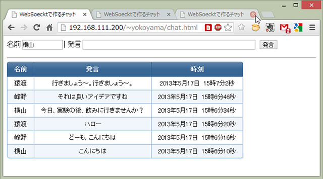

# WebSocketについて

node.jsは，WebブラウザGoogle Chromeに使われているJavaScript実行エンジンv8を用いたサーバサイドのJavaScript実行環境でした．node.jsは，PHPのようにApacheと一体となって動作するようには実装されていませんが，外部モジュールを使ってWebサーバとして動作させることも簡単にできます．一方，HTTPではなく，HTML5の周辺技術としてWebSocketというものもあります．

Webでの通信は，長らくHTTPしか選択肢がなく，HTTPのロングポートを使用しなんとか双方向通信を実現してきたという経緯があります．そのため，サーバから任意で情報を送信するプッシュ配信の実装が困難でした．WebSocketは，WebサーバとWebブラウザの双方間にTCPコネクションを構築することができるため，双方がそれぞれ必要に応じて送信を開始できるという特徴を持っています．また，HTTPに比べて小さなデータサイズで必要な情報を送信できるため，小さいメッセージを頻繁にやり取りするような場合はWebSocketがかなり有利となります．

自由課題の例として，WebSocketを使ってみるのもよいと思います．

## Node.js環境でのWebSocket導入方法

node.jsとnpmはすでにインストールされている前提での手順となります．

[WebSocket(ブラウザAPI)とws(Node.js) の基本](https://qiita.com/okumurakengo/items/c497fba7f16b41146d77)　※この辺もご参考まで

### 環境構築

まず，皆さんのホームディレクトリにnode.jsのスクリプトを格納するディレクトリを作成しましょう．

```sh
$ mkdir ~/node
$ cd ~/node
```

### WebSocketモジュールのインストール

WebSocketは，専用のモジュールをincludeして使用します．そのためまずはWebSocketモジュールをダウンロードしましょう．モジュールのダウンロードは，npmコマンドでできます．

-   [WebSocketモジュールの詳細](https://npmjs.org/package/websocket)

WebSocketモジュールは，背後でC++で書かれたネイティブコード（インタープリタで動作するJavaScriptやPHP，Javaに対して，予めコンパイルして比較的高速で実行させられる実行形式のバイナリファイルをネイティブコードと呼びます）を実行しています．このネイティブコードを作成するために，C++に対応したGCC（gcc-c++）のインストールと，node.jsのネイティブモジュール対応を行います．その後に，npmでWebSocketをインストールします．以下のようにインストールしてみてください．

```sh
$ sudo apt install gcc-c++         # <--- gcc-c++のインストール（既にインストール済みかも）
$ sudo npm install -g node-gyp     # <--- node.jsをネイティブモジュール対応させるモジュールのインストール (既にインストール済みかも）
$ npm install websocket            # <--- WebSocketモジュールのインストール
```

### WebSocket用のポートを開く

WebSocketを用いたサーバを動作させるので，FireWallの設定を変更してサーバ用のポートを開けなければいけません．また，班員それぞれで異なるポートを使用しなければならないことに注意してください． 以下の例では，TCPのポート番号**10080**を開く例で説明を進めます（[Wellknownポートや他のサービスで使用される可能性のあるポート](http://ja.wikipedia.org/wiki/TCP%E3%82%84UDP%E3%81%AB%E3%81%8A%E3%81%91%E3%82%8B%E3%83%9D%E3%83%BC%E3%83%88%E7%95%AA%E5%8F%B7%E3%81%AE%E4%B8%80%E8%A6%A7)は避けましょう）．

```sh
$ sudo ufw allow 10080/tcp
```

### MySQLモジュールのインストール

node.jsからMySQLへアクセスしたい場合は，MySQLモジュールを使用します．このように大抵の必要そうなモジュールはすでにあります．NPMのホームページで探してみましょう．

[https://npmjs.org/](https://npmjs.org/)

検索窓に「**MySQL**」と入力して探してみましょう．結果がたくさん出てきたと思います．`node`に限りませんが，同じ目的を達成するためのモジュールを様々な人が実装してくれています（中には正常に動作しない中途半端なものや意図せぬ動作が埋め込まれたものもありますのでご注意ください）．

一般的には，評価の高いモジュールや最初に出てきたモジュールを使用することが多いです．とりあえず今回は，最初に出てきた「[MySQL](https://npmjs.org/package/mysql)」というものを使用してみましょう．インストール方法もそのページに記載されていますので進めてみてください．サンプルコードもありますので，それらも参考に自分なりにプログラムを作成してみるとよいと思います．

WebSocketを用いた通信プログラムの第一歩としてチャットプログラムが代表的です．以下のgitリポジトリにサンプルコードがありますのでダウンロードして試してみてください．

- [https://github.com/ohkilab/SU-CSexpA-04](https://github.com/ohkilab/SU-CSexpA-04)

ダウンロードすると`chat.html`と`chat.js`というファイルがあります．htmlファイルがクライアント，jsファイルがサーバです．htmlもプログラム自体は，JavaScriptで書かれていますので，サーバとクライアントの両方がJavaScriptで書かれているということになります．

まず，両方のファイルをテキストエディタで開いてポート番号の記載がどうなっているか確認してください．**10080**以外を使用したい人は，両ファイルの該当箇所を修正してください．

修正が終わったら，htmlファイルをWebサーバのディレクトリへコピーし，jsファイルを`node`実行用に作成したディレクトリへコピーしてください．次に，サーバを起動します．JavaScriptはスクリプトですから，インタプリタを通して起動します．今回使用するインタプリタは，`node`です．以下のようにサーバ用スクリプト`chat.js`を起動させてください．

```sh
$ cp chat.js ~/node　　　　　　　# <--- サーバ用スクリプトchat.jsをコピー
$ cp chat.html ~/public_html     # <--- クライアント用ファイルchat.htmlをコピー
$ cd ~/node
$ node chat.js                   # <--- サーバ用スクリプトchat.jsの起動
```

これで準備が整いましたので，Webブラウザで`chat.html`へアクセスしてみてください．チャットプログラムですので，Webブラウザを複数起動させたり複数人で試してみたりしてください．以下のようにチャットできれば成功です．ちなみに**Internetへ接続していないと正常に動作しません**のでご注意ください（`chat.html`の5行目でajax.googleapiを参照してますので）．




以下にソースコードと解説を載せますので，このチャットプログラムがどう実装されているのか理解してみてください．

### サーバ側（chat.js）

```js
// Cのincludeと同様に，外部モジュールを読み込みます
var WebSocketServer = require('websocket').server;
var http = require('http');

//クライアントと同じポートを指定しなければいけません。(10080以外のポートを使っている人はここの値を変えてください)
var port = 10080;

// WebSocketは，HTTPサーバとして接続を受け付けた後にプロトコルをWebSocketに変更するため，まずはHTTPサーバを作成します
var server = http.createServer(function (request, response) {
  console.log((new Date()) + ' Received request for ' + request.url);
  response.writeHead(404);
  response.end();
});
server.listen(port, function () {
  console.log((new Date()) + ' Server is listening on port ' + port);
});

// WebSocketサーバを立ち上げるための定形処理です

wsServer = new WebSocketServer({
  httpServer: server,
  autoAcceptConnections: false
});

function originIsAllowed(origin) {
  return true;
}

// 接続クライアントを管理するための連想配列を定義しています

var connections = {};
var connectionIDCounter = 0;

// クライアントからの接続要求が届いたときに呼び出されます
wsServer.on('request', function (request) {
  // 定形処理です
  if (!originIsAllowed(request.origin)) {
    request.reject();
    console.log((new Date()) + ' Connection from origin ' + request.origin + ' rejected.');
    return;
  }
  // その時点で接続している全クライアントへデータを送るための関数の定義です
  var sendUTFAll = function (msg) {
    Object.keys(connections).forEach(function (key) {
      console.log("key:" + key);
      connections[key].sendUTF(msg);
    });
  }
  // クライアントの接続を受け付ける定形処理です
  var sendBinaryAll = function (msg) {
    Object.keys(connections).forEach(function (key) {
      connections[key].sendBinary(msg);
    });
  }
  var connection = request.accept('chat', request.origin);
  connection.id = connectionIDCounter++;
  connections[connection.id] = connection;
  console.log((new Date()) + ' Connection ID ' + connection.id + ' accepted.');
  // クライアントからデータが届いた時に呼ばれる関数で，内部では単に届いた文字列を全クライアントへ送り返しているだけです
  connection.on('message', function (message) {
    if (message.type === 'utf8') {
      console.log('Received Message: ' + message.utf8Data);
      sendUTFAll(message.utf8Data);
    }
    else if (message.type === 'binary') {
      console.log('Received Binary Message of ' + message.binaryData.length + ' bytes');
      sendBytesAll(message.binaryData);
    }
  });
  // クライアントとの接続を閉じた時に呼ばれる関数で，connections連想配列から自分自身を削除しています
  connection.on('close', function (reasonCode, description) {
    console.log((new Date()) + ' Peer ' + connection.remoteAddress + ' disconnected. ' +
      "Connection ID: " + connection.id);
    delete connections[connection.id];
  });
});
```

このサーバプログラムは，基本的にはechoプログラムです．ポート10080に接続したクライアントから届いた文字列を，そのまま接続されている他の全クライアントへ送信しています．コメントアウトにメモを載せておきますので，参考にしながらソースコードを読んでみてください．

### クライアント側（chat.html）

HTML全体を引用すると長いため，JavaScript部分だけ説明します（なお，ライブラリにjQueryを使ってます）

```js
// jQueryの機能で，ページ全体がWebブラウザにロードされたタイミングでこの中のコードが実行されます
$(document).ready(function () {
  //サーバと同じポートを指定しなければいけません。(10080以外のポートを使っている人はここの値を変えてください)
  var port = 10080;

  console.log("ready");
  // WebSocketサーバのURLを指定してください
  var ws = new WebSocket('ws://192.168.111.200:' + port + '/', ["chat"]);
  // voiceというidを持つフォームが登録されたとき，つまりボタンが押されるか入力フォームでエンターキーが押されると，ここが実行されます
  $("#voice").submit(function () {
    // 名前のテキストフィールドが空欄の場合は適当に名前を付けます
    if ($("#name").val() == "") {
      $("#name").val("匿名さん" + Math.round(Math.random() * 1000));
    }
    // 発言のフィールドが空欄の場合は何もしないで処理を返します
    if ($("#message").val() == "") {
      return false;
    }
    // サーバに送るデータを作っており，名前と発言と発言時刻からなるJavaScriptの連想配列にします
    var date = new Date();
    date = date.getFullYear() + "年" + date.getMonth() + "月" + date.getDate() + "日　" + date.getHours() + "時" + date.getMinutes() + "分" + date.getSeconds() + "秒";
    var msg = {
      "name": $("#name").val(),
      "message": $("#message").val(),
      "time": date
    };
    console.log("I said '" + $("#message").val() + "'");
    // 発言のテキストフィールドを空欄にして，フォーカス（カーソル点滅）させます
    $("#message").val("");
    $("#message").focus();
    // 連想配列をJSON（文字列）に変換してサーバへ送信します（[JSON](http://ja.wikipedia.org/wiki/JavaScript_Object_Notation)とは，JavaScriptのサブセットの文法を持つデータ記述言語でJavaScriptとの親和性が非常に高いのが特徴です）
    ws.send(JSON.stringify(msg));
    return false;
  });
  // サーバからデータが送信された時にここが実行され，ここではテーブルの先頭（ヘッダ行の直後）に発言の行を挿入しています
  ws.onmessage = function (event) {
    var data = JSON.parse(event.data);
    $("#chat").after("<tr><td>" + data["name"] + "</td><td>" + data["message"] + "</td><td>" + data["time"] + "</td></tr>");
  }
});
```
