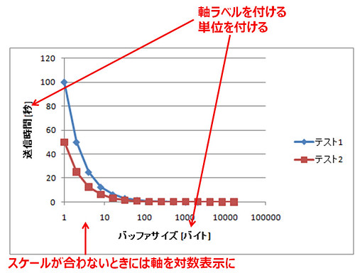

## 個別最終レポート

### 学務情報システムでの提出

学務情報システムへレポート（.docx），ソースコード一式（コンパイルに必要なファイル群一式をzipで圧縮，実行形式ファイルは含めないこと！）を提出してください．

また，**実験終了後のサーバ初期化や解体作業の予定者と予定日**も相談して決めて，各自のレポート最後に誰がいつ実施するのか追記しておいてください．

学務情報システムで提出できない人は，例外としてメール添付によるレポート提出（圧縮してあっても添付ファイル群の拡張子に注意！）も受け付けます．メール添付での提出の場合，数日たっても受領のメール返信がない場合は，**添付なしのメール**で提出できているか確認メールをお願いします

### メール添付での提出

-   To: csexp1-report@ml.inf.shizuoka.ac.jp
-   Cc: <自分のメアド>
-   Subject: CS実験I-Last-班番号-cs13xxx
    -   例）CS実験I-Last-B3-cs13385
-   添付: レポート（.docx），ソースコード一式（コンパイルに必要なファイル群一式をzipで圧縮，実行形式ファイルは含めないこと！含めるとメールサーバでメール自体が破棄されてしまいそうですので）
-   提出後に誤りを見つけて再提出したい場合は，件名の最後に「(2回目)」というように分かるよう記載すること
-   メールの本文には，以下（あくまで例です）のように記載すること

```
科学科実験Iご担当の先生方へ

B3班の70xx-00xx静大太郎です．
最終個別レポートを提出させていただきます．

実験終了後のサーバ初期化や解体作業は，静大花子さんが2017年8月10日に実施してくれることになりました．

どうぞよろしくお願いいたします．

```

### 提出WORDファイルのテンプレート

以下のテンプレートを使って個別最終レポートを作成してください．

-   [WordのPart3用テンプレート](https://exp1.inf.shizuoka.ac.jp/%E3%83%95%E3%82%A1%E3%82%A4%E3%83%AB:CSexp1Chapter3Report.zip "ファイル:CSexp1Chapter3Report.zip")

### 表紙に関して

ここまでの課題で最低限の知識と技術を身に着けているか確認したいため，必ず自力で実施してください（自力でできない人はこれまでの専門科目を再復習したうえで，来年度もう一度再履修してください）．レポート内容や実装方法に関する相談は問題ありませんが，**この結果を教えてあげること**は絶対にしないでください．

以下のクエリでデータベースからidと画像を取得しレポート表紙に張り付けてください(テンプレート表紙にあるサンプル画像を差し替えてください)．

このクエリは，皆さんの**学籍番号**を使ったSELECT文です．つまり，全員異なる画像を張り付けることになります．

```sql
--学籍番号が70310051の場合，以下の数値部分に学籍番号先頭の「70」をとった数値を入れる

SELECT * FROM geotag WHERE id = (
  SELECT id FROM geotag
  ORDER BY id
  LIMIT 1
  OFFSET 310051);
--       ^^^^^^---ここ！

```

### 内容に関して

以下を参考に個別最終レポートを完成させてください．

```
第1章基礎課題（全員）
 1.1.実装A
  (ア)仕様
    ここに記載してください。
  (イ)実装の特徴
    ここに詳細な説明を記載してください。
 1.2.実装B
  (ア)仕様
    ここに記載してください。
  (イ)実装の特徴
    ここに詳細な説明を記載してください。
 1.3.実装C
  (ア)仕様
    ここに記載してください。
  (イ)実装の特徴
    ここに詳細な説明を記載してください。
 1.4.性能比較
  (ア)仮説と実験条件
    仮説を検証するための実験条件を、第三者が再現できるよう図表を用いて記載してください。
  (イ)結果
    ここに様々な観点（リソース使用状況，設定値（ソースコード、OS等）、など）で分析（試行回数、検定、
   平均、95%信頼区間、箱ひげ図、など）した結果を図表でまとめてください。
  (ウ)考察
    結果に対する考察を論理的にまとめてください．

第2章応用課題（担当した方のみで構いません）
 2.1.超高性能化
  (ア)MPM実験の概要と仮説，実験条件
    仮説を検証するための実験条件を、第三者が再現できるよう図表を用いて記載してください。
  (イ)MPM実験の結果
    ここに様々な観点（リソース使用状況、設定値（ソースコード、OS等）、など）で分析（試行回数、検定、
   平均、95%信頼区間、箱ひげ図、など）した結果を図表でまとめてください。
  (ウ)MPM実験の考察
    結果に対する考察を論理的にまとめてください。
  (エ)KeepAlive実験の概要と仮説，実験条件
    仮説を検証するための実験条件を、第三者が再現できるよう図表を用いて記載してください。
  (オ)KeepAlive実験の結果
    ここに様々な観点（リソース使用状況、設定値（ソースコード、OS等）、など）で分析（試行回数、検定、
    平均、95%信頼区間、箱ひげ図、など）した結果を図表でまとめてください。
  (カ)KeepAlive実験の考察
    結果に対する考察を論理的にまとめてください。
 2.2.自由課題
  (ア)背景と仕様
    ここに記載してください。
  (イ)実装の特徴
    ここに詳細な説明を記載してください。
  (ウ)結果と考察
    結果に対する考察を論理的にまとめてください。

第3章実験I全般のまとめ（来年度の参考にさせてください）
 3.1.実験内容や進め方の改訂について（良さそうな案は反映させたいと思います）
  (ア)第一部について
    来年度に向けたコメントや具体的な改定案などありましたらここに記載してください。
  (イ)第二部について
    来年度に向けたコメントや具体的な改定案などありましたらここに記載してください。
  (ウ)第三部について
    来年度に向けたコメントや具体的な改定案などありましたらここに記載してください。
 3.2.実験I全般の感想
  実験I全般で得たこと、興味深かったこと、自身や周囲の取り組み状況、
 感想など今後の参考にしますので自由に書いてください。

謝辞
  本最終課題を実施するにあたって、お世話になった方々をリストアップしてください。
  例）学籍番号、名前

  また，実験終了後のサーバ初期化や解体作業は，静大花子さんが2017年8月10日に実施してくれることになりました．
  ここに記して感謝の意を表したいと思います．

参考文献
  本レポートをまとめるにあたって、参考にした文献などを記載してください。
  [1]書籍の場合，著者名あるいは編者名，書名，参照ページ，出版社，出版年．
  [2]論文集に掲載された論文・雑誌論文・記事の場合，著者名，論文タイトル，学会名，
      雑誌名，巻数・号数，掲載ページ，掲載年．
  [3]Ｗｅｂページ（インターネットのページ）の場合，作成者（分かれば），Webページ
      のタイトル，アドレス（URL），アクセスした日付．
  [4]など

付録
  ソースコードを以下に貼り付けてくれてもよいですし，全ソースコード（実行形式ファイルは不要）
 を圧縮し別ファイルとして添付してくれても構いません．こちらで再現できるファイル群一式がそろ
 っていると助かります．

```

参考文献や以下のサイトなども参考に，体裁の整った良いレポートを作成してください．

-   [レポートの書き方](http://yufu.cs.inf.shizuoka.ac.jp/mediawiki/index.php/%E5%AE%9F%E9%A8%93%E3%83%AC%E3%83%9D%E3%83%BC%E3%83%88%E3%81%AE%E6%9B%B8%E3%81%8D%E6%96%B9) (学内ONLY, written by Professor Shiomi!!)

## ツール紹介

レポートを作成する際に便利なツールを紹介します．このツールを利用することが必須ではありません．むしろ，自分の方法にあったツールを自分で探す（探す方法を確立する）方がより重要です．

### TeX

-   LaTeX
    -   [TeX Wiki](https://texwiki.texjp.org/)
    -   [TeX Wiki: TeX入手方法](https://texwiki.texjp.org/?TeX%E5%85%A5%E6%89%8B%E6%B3%95)
    -   [TeX Wiki: LaTeX入門](https://texwiki.texjp.org/?LaTeX%E5%85%A5%E9%96%80)

### 図・グラフなどの作成（TeXの場合）

図・グラフなどは各自が選んだソフトウェアで作成してください．ただし，TeXに取り込む場合には eps 形式に変換する必要があります（他の形式（例えば画像形式やPDF形式）でも不可能ではないです）．

-   [PowerPointからTeX用のepsファイルを生成する方法](http://kano.arkoak.com/2015/09/26/eps/)
-   [Metafile to EPS Converter で Windows Metafile を EPS に変換](http://qiita.com/tubo28/items/1f8672fb164aafa9ab31)
    -   [Meta file to EPS Converter](https://wiki.lyx.org/Windows/MetafileToEPSConverter)
-   [How to Convert PowerPoint Pictures for Use in LaTeX](https://www.cs.bu.edu/~reyzin/pictips.html)

### シーケンス図などのUMLの図の作成

シーケンス図などのUMLで定義された図を作成する場合は，IllustratorやPowerPointなどのドローソフトで作成しても良いですが，モデリングツールを利用しても良いでしょう．

-   [Astah\* community edition](http://astah.change-vision.com/ja/product/astah-community.html)
-   [MS Visio: UMLシーケンス図を作成する](https://support.office.com/ja-jp/article/UML-%E3%82%B7%E3%83%BC%E3%82%B1%E3%83%B3%E3%82%B9%E5%9B%B3%E3%82%92%E4%BD%9C%E6%88%90%E3%81%99%E3%82%8B-c61c371b-b150-4958-b128-902000133b26)

### ネットワーク構成図の作成

IllustratorやPowerPointなどのドローソフトとルータ等の機材のフリー画像（PowerPointの場合は「挿入→ネットワーク画像」から "ネットワーク機器" などのキーワードで検索（クリエイティブ・コモンズライセンスに限定））を使って作成しても良いですが，ネットワーク構成図を作成する機能を持つアプリケーションを使っても良いでしょう．

-   [ITエンジニア向け Visioシェイプ](http://www.microsoft.com/ja-jp/visio/free/ite.aspx)
    -   MS Visioに同梱されているネットワーク関係のステンシルでも十分ですが，特定メーカの機器のステンシルを使いたい場合はここからダウンロード
-   [ネットワーク構成図を無料で作成する\[アイコン/素材](http://www.petitmonte.com/network/network_diagram.html)\]
-   [draw.io](https://www.draw.io/)
    -   新規に作成するダイアグラムの種類から Network Diagramを作成
-   [blockdiag - simple diagram images generator](http://blockdiag.com/en/)
    -   テキストベースでグラフを作成するツール．ネットワーク構成図を作るには[nwdiag](http://blockdiag.com/en/nwdiag/index.html)を用いると良いです．

### スクリーンショットの撮り方

画面のスクリーンショットを撮る場合はOS標準の方法と専用のアプリケーションを導入する方法があります．機能に多少の違いがありますので，必要なスクリーンショットに合わせて使い分けてください．

-   Windows標準の方法
    -   [Windowsのスクリーンショットの撮り方](https://allabout.co.jp/gm/gc/20843/)
    -   [Snipping Tool を使ってスクリーン ショットをキャプチャする](https://support.microsoft.com/ja-jp/help/13776/windows-use-snipping-tool-to-capture-screenshots)
-   専用アプリケーションの例
    -   [Lightscreen](http://lightscreen.com.ar/)

### PDFの作成

-   MS Officeの場合
    -   直接PDFファイルをエクスポート可能です．
        -   参考: [PDF に保存または変換する](https://support.office.com/ja-jp/article/PDF-%E3%81%AB%E4%BF%9D%E5%AD%98%E3%81%BE%E3%81%9F%E3%81%AF%E5%A4%89%E6%8F%9B%E3%81%99%E3%82%8B-d85416c5-7d77-4fd6-a216-6f4bf7c7c110)
-   TeXの場合
    -   DVI形式のファイルに対して dvipdfmx コマンドを使ってPDFに変換します．

## 提出前のチェックリスト

### 構成

-   使用機材は明記しているか？
    -   最低限、読んだ人が実験を再現できるだけの情報が必要です．

### 書式

-   指定したフォーマットを使用しているか？
    -   学会、会社、行政文書など、すべてに規定されたフォーマットがあります．
-   すべての図と表にキャプションがついているか？
-   すべての図と表は本文中で引用されているか？
-   すべての図と表は本文中で引用されている箇所が明確か？
    -   読者が意図通りの箇所を参照できるような本文中の表現，図・表の表現が必要です．特に図・表に含まれる情報量が過剰な場合，読者は混乱します．本文の論旨に必要な箇所を本文中の図・表とし，全体の情報は付録で提示するなどの工夫を検討してください．
-   図・表のキャプションの書式は適正か？
    -   図のキャプションは図の下側に配置
    -   表のキャプションは表の上側に配置
-   すべての参考文献は本文中で引用されているか？
-   フォントの種類やサイズが統一されているか？
    -   文書全体で1つのフォントに統一する必要はありませんが，第1章の見出しはボールド体，第2章の見出しは明朝体などといった不整合は許容されません．
-   句読点は統一されているか？ (、。 もしくは，．のいずれかに統一すること)
    -   半角のカンマ・ピリオド(, . )を使う場合には直後にスペースが必要です．

### 文体

-   箇条書きを必要以上に多用していないか？
-   こそあど言葉(これ，それ，このなど)を多用していないか？
    -   読者が参照先に迷うため，極力こそあど言葉は避けてください．
    -   具体的な名詞を使って代替することができるはずです．
-   接続詞(そのため、しかしなど)を必要以上に多用していないか？
    -   接続詞を多用しなければならないときは文章の構成がおかしい場合が多いです．
    -   一般的には接続詞は続く文章を強調したい場合に使います．
-   必要以上に1文が長くなっていないか？
    -   「～し，」という表現を多用していないか？
        -   「～し，」という言葉を使うと一見文章がつながってみますが，実は論理的につながっていない場合が多いです．
        -   「～し，」という表現を使いそうになったら，2つの文章に分けることができないか考えてみてください．

### グラフ

-   適切なグラフの種類を選択しているか？
    -   用途に応じてグラフの種類が存在します．例えば，折れ線グラフと散布図は見かけ上類似点がありますが，利用目的が異なります．折れ線グラフは1つのものごとの移り変わりを表現する場合（典型的には時系列データ），散布図は2つの数値データの関係を表現する場合に採用します．これ以外のグラフについても，用途に合わせて適切なグラフの種類を選択してください．
        -   参考: [Excel2010：折れ線グラフと散布図の違いとは](http://office-qa.com/Excel/ex194.htm)
-   軸ラベルが用意されているか？
-   軸ラベルには単位が記載されているか？
-   グラフ中の値を読むことができるサイズ・品質か？
    -   対数表示の利用も選択肢のひとつです．
        -   MS Excelの場合は軸の書式設定で「対数目盛を表示する」をチェックします．



## 参考文献

-   [日本語の作文技術 (朝日文庫): 本多 勝一](https://www.amazon.co.jp/dp/4022608080/)
-   [\[改訂第7版］LaTeX2ε美文書作成入門](http://gihyo.jp/book/2017/978-4-7741-8705-1)