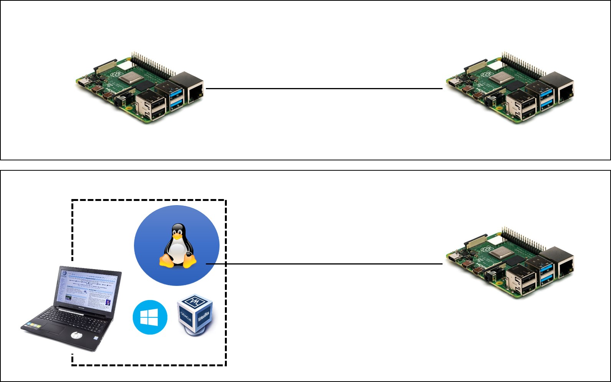

# 環境構築

## VNCクライアントのインストール
皆さんのノートPCにインストールされているWindowsから，ネットワーク接続を介してリモートでRaspberry Piのデスクトップ環境を利用するために，VNCクライアント（サーバは不要です）をノートPCのWindowsへインストールしておきます．

Raspberry Pi上のRaspbian OS に標準でインストールされている VNC Server との接続は，以下の Real VNC のクライアントソフトウェアが接続しやすいようです（他のVNCクライアントソフトウェアでもサーバ側の設定を変更すれば接続可能）．ノートPCのWindowsへクライアント（VNC Viewer）のみをインストールして下さい（WindowsへVNC Serverをインストールする必要はありません）．Real VNC社のVNC Connectは商用ソフトウェアですが，Viewerに関しては Free で配布されています．

[RealVNC](https://www.realvnc.com/en/connect/download/viewer/windows/)

> RealVNC社の "Frequently asked questions" より引用
> Do I need to license the software?
> No. VNC® Viewer is always free to use. Just accept the EULA the first time you run.

## Virtual BoxとVMの準備

### 概要
従来，情報科学実験Aではグループを構成して実験を進める計画になっています．

従って，グループ内の複数のRaspberryPi間で通信を行うプログラムを構築し，その通信内容や通信性能を計測し，分析します．

しかしながら，個人で実験を進めなければならない場合も時にはあるかと思いますので，その際は各自のノートPC上にLinux環境を構築して通信アプリケーションの片側を実行するようにします．

RaspberryPi同士の通信環境とは異なる環境になりますので，異なる環境間で計測結果の比較を行うことは妥当ではありません． この点には注意が必要ですが，通信アプリケーションの開発と動作確認には使えるでしょう．



### Virtual BoxとLinux VMの導入

```{important}
本講義では設定を大きく変更するため，他教科や後に使う際の保険のためにも**新しくVMを構築してください.**
```

[Oracle VM VirtualBox](https://www.virtualbox.org/wiki/Downloads)

静岡大学情報学部で学年度ごとに用意しているLinux VMとインストールガイドは以下にありますので，参照しながらVM構築を行ってください． 
（oooo部分は入学年度で置き換えてください．）

[http://whitebear.cs.inf.shizuoka.ac.jp/linux/oooo/](http://whitebear.cs.inf.shizuoka.ac.jp/linux/oooo/)

新規VMの追加設定は後にも行います.上記ページののダウンロード後の設定手順を終えたらそのままにしておいてください．

## Slackへの登録
本年度は学生間の連絡にSlackを使います．

機材配布時に配った資料を参考に，Slackへの参加登録を済ませておいてください．
