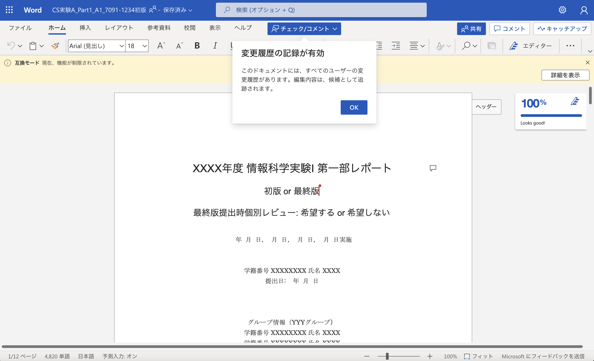
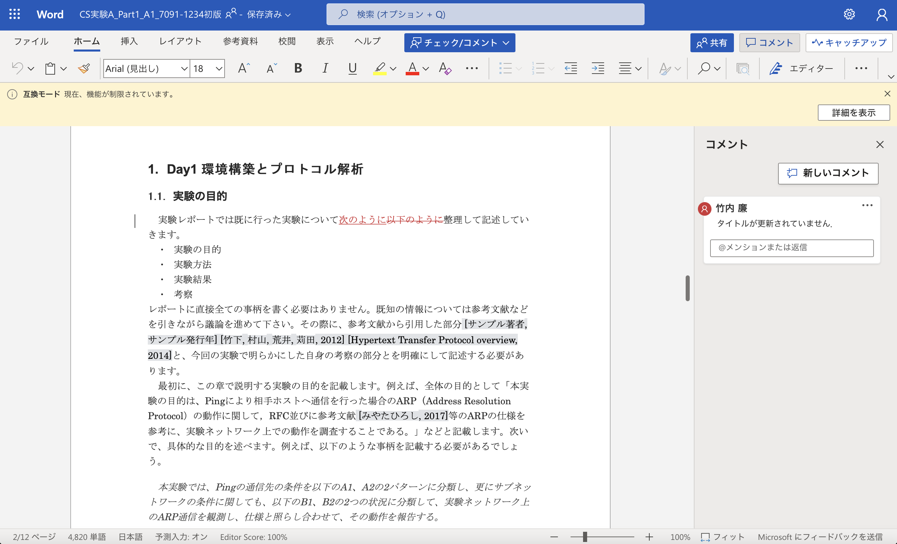

# ピアレビュー

## 事前準備

-   各自のレポートファイル（MS Wordフォーマット）

レポート初版を提出する時点でグループの他メンバーにピアレビューしてもらうためのページを準備してあるはずです．

以下のようになっていない場合は，急いでレポートピアレビューのページを準備してください．

```
表紙
レポートピアレビュー（1人目用）
レポートピアレビュー（2人目用）
レポートピアレビュー（3人目用）
　　　　：
レポートピアレビュー（N人目用）
目次
　　　　：
```

レビューはMS Wordの校閲機能（特にコメント機能並びに変更履歴の記録機能）を使って行います．

最終的にレビューを受けたファイルと，そのレビュー内容を踏まえて作成した最終版のファイルの両方が提出対象になります．

## レビュー方法

自分のレポートをグループの他のメンバにレビューしてもらうようにします．従って，4人グループですと自分のレポートを3人からレビューをしてもらう & 自分は3つのレポートのレビューをすることになります．自分のレポートは初版提出時に既にチェック済のはずですので，この時間では自分自身のレポートはレビューの対象とはしません．

複数人が並行してレビュー作業を行える方が効率が良いので，レビューはOffice365の共同編集機能を利用して行います．

自分のレポートの共有は以下の手順で行なってください．

1. 初版のレポートのファイル（e.g. `CS実験A_Part1_A1_7091-1234初版.docx`）を開きます．

2. 開いたWordの右上にある「共有」をクリックし，名前／場所／移動orコピーを設定してアップロードします．

3. もう一度「共有」をクリックし，「リンクのコピー」にある「リンクを知っているShizuoka Universityのユーザーが表示できます ＞」をクリックします．

4. 「編集を許可する」にチェックをつけて，「レビューモードでのみ開く」をオンにして「適用」をクリックします．

5. 「リンクをコピーしました」と出るので，Slackのグループチャンネルにリンクを貼り付けて送信します．

 &nbsp;&nbsp; 

 &nbsp;&nbsp; 

他の人のレポートをレビューする際は以下の手順で行ってください．

- 共有されたリンクをクリックして，ファイルを開く．



- 編集モードが「チェック／コメント」になっていることを確認したら，そのままレポートを読んだ上で，気づいた点についてコメントを追加したり，修正案を示したり校正して下さい．



## 全体レビュー

1.  レビューを受けたレポートを参照します．
2.  他のレビューアからの指摘をチェックして，理解し納得できて自分がこのままレポートを更新できる指摘と，このままではうまくレポートを更新できない指摘（レビューアに質問したい指摘，レビューアによってあるいは自分とレビューアとの間の考え方がに差異があるなど考え方を整理したい指摘）に整理します．
3.  このままではレポートを更新できない指摘について，レビューアに確認するなどしてレポート作成者がレポートを改善できるまでに整理し具体化して下さい．

## レビューを受けてレポート改善

レビュー内容を元にレポートを改善します．

更にこのピアレビューの活動に対する考察を最後に追加してください．

今回，ピアレビューして**コメント記載済みの初版レポートは，最終レポートの提出時に合わせて提出**して下さい．